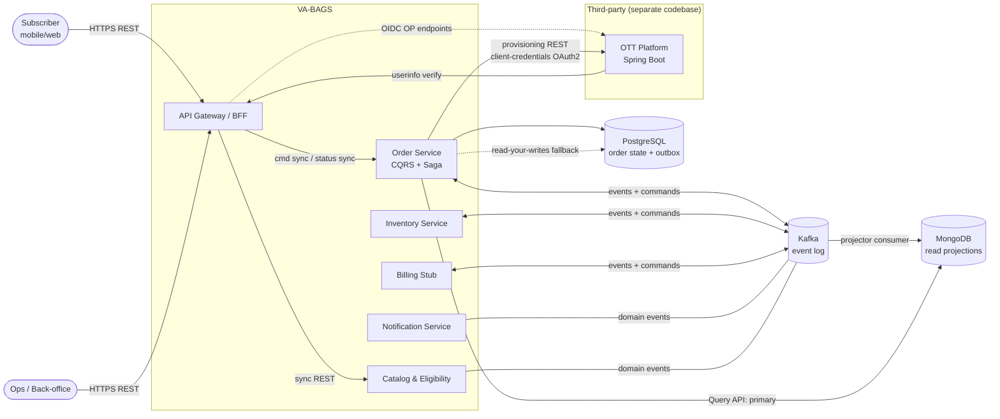

# System Context

## What the system is

**Value Added: Benefits (VA-BAGS)** — a telecom backend that leverages an existing subscriber base (identity, KYC, billing relationship, device IMEI) to sell adjacent goods and services billed to the mobile account.

Representative catalog:
- OTT subscriptions (Netflix, Hotstar bundles)
- Device protection plans (requires IMEI)
- Priority repair (slot-based, geographic)
- Personalized tones / RBT (network-side provisioning)
- Cloud storage / security bundles
- Accessories (physical, bill-to-mobile)

**Scale envelope:** ~50 order TPS (writes), ~300 RPS (reads). Comfortably a single-node Postgres workload — none of CQRS/read-store/CDC is load-bearing for throughput. Each pattern is justified by *capability* (distributed transaction, strategic event log, read-shape), not scale. See DD-14.

---

## System context diagram

---

## Sync vs async edge matrix

| Edge | Mode | Reason |
|---|---|---|
| Client → Gateway | Sync HTTPS | User is waiting |
| Gateway → Catalog (browse/eligibility) | Sync + cache | Read-only, latency-critical |
| Gateway → Order command | Sync request → `202 Accepted` | Decouple submission ack from fulfillment |
| Gateway → Order Query API | Sync | Fast denormalized read |
| Order Saga ↔ Inventory / Billing | **Async Kafka** | Long-lived, retryable, participant restarts safe |
| Order Saga → OTT provisioning | Sync REST wrapped in async Saga step | External REST contract; the Saga step itself is async |
| Domain events → Notification, Projector | **Async pub/sub** | Must never block writers |
| Cross-service queries | **Forbidden** | Sync cross-service reads = gateway drug to distributed monolith |

---

## Key invariants

1. No service reads another service's database.
2. No business logic in the Gateway.
3. The read side serves from MongoDB by default; its **only** permitted read of the write-side Postgres is the bounded read-your-writes fallback (lookup by `orderId` during projection lag). No JOINs, no list/scan queries against the write store.
4. Every mutating boundary uses the Eventuate CDC outbox (Tram `message` table) — no direct Kafka publish from application code.
