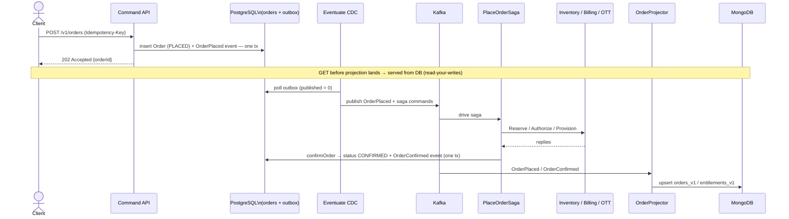

# Order Service — Deep Dive

> **Redesign note (DD-14/DD-15).** This deep-dive reflects the **post-Event-Sourcing** target: the Order aggregate is **state-stored** (a normal JPA row), and domain events are published to Kafka through Eventuate **Tram's transactional outbox**, not by event-sourcing the aggregate. Kafka remains the durable event log (replay/analytics). The MongoDB read model is an optional optimization with a read-your-writes fallback to Postgres. *Code migration from Eventuate Local ES is in progress; `docker-compose.yml` still provisions the legacy `localpipeline` until that lands.*

## Internal architecture

```mermaid
flowchart TB
    subgraph ORD[Order Service — single deployable]
        CMD[Command API\nPOST /v1/orders\nPOST /v1/orders/{id}:cancel]
        IDEM[Idempotency Filter\nidempotency_keys table]
        AGG[Order\nstate-stored JPA aggregate]
        SAGA[PlaceOrderSaga\nEventuate Tram Sagas]
        PG[(PostgreSQL\norders · saga · outbox)]
        CDC[Eventuate CDC\npolls Tram outbox → Kafka]
        PROJ[OrderProjector\nTram domain-event handler]
        MONG[(MongoDB\norders_v1\nentitlements_v1\norder_search_v1)]
        QRY[Query API\nGET /v1/orders/*\nGET /v1/entitlements]
    end

    KAFKA[(Kafka\nevent log)]

    CMD --> IDEM --> AGG
    AGG -->|order state + domain events\nin one transaction| PG
    PG --> CDC --> KAFKA
    KAFKA --> SAGA
    SAGA --> KAFKA
    SAGA -->|invokeLocal: confirm / fail| AGG
    KAFKA --> PROJ --> MONG
    QRY -->|primary path| MONG
    QRY -.->|read-your-writes fallback\nlookup by orderId| PG
```

## Order placement — end-to-end sequence



---

## Event envelope (every event)

```json
{
  "eventId": "uuid",
  "eventType": "order.OrderPlaced.v1",
  "aggregateId": "ord_01H...",
  "aggregateVersion": 1,
  "occurredAt": "2026-05-27T10:15:30.123Z",
  "correlationId": "uuid",
  "causationId": "uuid",
  "schemaVersion": 1,
  "payload": {}
}
```

`aggregateVersion` is the monotonic per-order sequence carried on each event (used by the projector to discard stale/out-of-order updates). `causationId` = id of the command/event that triggered this. Together they enable full causal-chain reconstruction **from the Kafka event log** (the durable record now that the aggregate is state-stored).

---

## Event catalog (Order domain events, v1)

These are **domain events published via the Tram outbox** to Kafka. Two classes:
**published** lifecycle events (▶) cross the service boundary and feed the projector, Notification, and analytics; **saga-internal** transitions (·) are tracked in saga state and need not be published as standalone domain events in the state-stored design.

| | Event | Trigger | Key payload fields |
|---|---|---|---|
| ▶ | `order.OrderPlaced.v1` | `PlaceOrder` command accepted | `subscriberId`, `offerCode`, `priceSnapshotId`, `amount`, `currency`, `billingMode`, `idempotencyKey` |
| · | `order.InventoryReservationRequested.v1` | Saga step 1 started | `inventoryType`, `resourceRef`, `quantity` |
| · | `order.InventoryReserved.v1` | Participant reply | `reservationId`, `expiresAt` |
| · | `order.InventoryReservationFailed.v1` | Participant reply | `reason` (enum), `detail` |
| · | `order.BillingAuthorizationRequested.v1` | Saga step 2 started | `amount`, `currency`, `billingMode` |
| · | `order.BillingAuthorized.v1` | Participant reply | `authId`, `authorizedAt` |
| · | `order.BillingDeclined.v1` | Participant reply | `reason` (enum), `detail` |
| · | `order.EntitlementProvisioningRequested.v1` | Saga step 3 started | `targetSystem`, `externalAccountRef` |
| ▶ | `order.EntitlementProvisioned.v1` | OTT REST success | `externalRef`, `validFrom`, `validUntil` |
| · | `order.EntitlementProvisioningFailed.v1` | OTT REST failure | `reason`, `detail`, `retryable` |
| ▶ | `order.OrderConfirmed.v1` | All steps succeeded | `confirmedAt` |
| ▶ | `order.OrderFailed.v1` | Terminal failure | `failedStep`, `terminalReason` |
| · | `order.CompensationCompleted.v1` | All rollbacks done | `compensatedSteps` (ordered list) |
| ▶ | `order.OrderCanceledByUser.v1` | Cancel command in cooling-off | `canceledAt`, `withinCoolingOff` |

**Versioning rule:** `.v1` schemas are immutable. Only additive changes allowed. Breaking change → new `.v2` topic; projectors handle both during transition window. Old topic retained until all consumers drain.

---

## Idempotency contract

| Layer | Responsibility |
|---|---|
| Client | Generate UUIDv4 per logical user intent. Reuse on network retry of same intent. |
| Gateway | Validate header presence + UUIDv4 format. Reject `400` if missing on `POST /v1/orders`. Pass through — does not store. |
| Order Command API | Lookup `(subscriberId, idempotencyKey)` in `idempotency_keys` table. If hit → return stored response. If miss → process + store atomically with aggregate write. |
| TTL | 24 hours. After expiry, same key is a fresh request. |
| Scope | `(subscriberId, idempotencyKey)` — not global. Two subscribers may share a UUID without collision. |
| Conflict | Same key + different payload → `409 Conflict`. |

---

## Entitlement uniqueness — three defense layers

1. **Command validation** — before accepting `PlaceOrder`, query `entitlements_v1` Mongo collection for active `(subscriberId, offerCode)`. Reject `409` if found. *(First line — catches 99.9% of cases.)*

2. **MongoDB unique partial index** on `{subscriberId, offerCode}` where `status = "ACTIVE"`. Projector insert fails on duplicate → DLQ. *(Safety net for projection-lag race between two near-simultaneous requests.)*

3. **OTT provisioning API** returns `409` on duplicate entitlement → Saga treats as non-retryable → compensates. *(Defense in depth at the third-party boundary.)*

---

## MongoDB read projections

### `orders_v1` — order detail + list
```json
{
  "_id": "ord_01H...",
  "subscriberId": "sub_...",
  "offerCode": "OTT_NETFLIX_6M",
  "offerName": "Netflix 6-month bundle",
  "amount": 599,
  "currency": "INR",
  "status": "CONFIRMED",
  "placedAt": "...",
  "confirmedAt": "...",
  "timeline": [
    { "at": "...", "status": "PLACED" },
    { "at": "...", "status": "RESERVED" },
    { "at": "...", "status": "CONFIRMED" }
  ],
  "version": 5
}
```
Indexes: `{subscriberId:1, placedAt:-1}`, `{status:1}`

`version` = the order's monotonic state version (its JPA `@Version`, stamped onto each emitted event). The projector applies an update only if the event's `version` ≥ the stored doc's `version`, discarding stale/out-of-order deliveries.

### `entitlements_v1` — active benefits + uniqueness check
```json
{
  "_id": "ent_01H...",
  "subscriberId": "sub_...",
  "offerCode": "OTT_NETFLIX_6M",
  "status": "ACTIVE",
  "validFrom": "...",
  "validUntil": "...",
  "sourceOrderId": "ord_...",
  "externalRef": "ott_netflix_xyz"
}
```
Indexes: `{subscriberId:1, status:1}`, **unique partial** `{subscriberId:1, offerCode:1}` where `status:"ACTIVE"`

### `order_search_v1` — ops dashboard
Flattened, no timeline, indexed on `{placedAt:1}`, `{status:1}`, `{offerCode:1}`.

Demonstrates: one event stream → multiple independent read shapes.

---

## Read-your-writes (DD-15)

The read model is **eventually consistent**: a `POST /v1/orders` commits to Postgres immediately, but `orders_v1` only fills after CDC → Kafka → projector runs (~hundreds of ms in Polling mode). A client that GETs the order in that window would otherwise get a spurious `404`.

`GET /v1/orders/{id}` therefore uses a bounded fallback:

```
1. Look up orders_v1 in MongoDB (primary, fast path).
2. Hit  → return it.
3. Miss → look up the order row in Postgres (write store).
            exists?     → return a minimal view (status from the row, empty/partial timeline)
            not found?  → real 404
```

So a freshly-placed order is always visible (served from Postgres until the projection catches up); once the projector writes `orders_v1`, reads return to the fast path. The fallback fires only inside the consistency-lag window — and the system stays **correct even if the projector/CDC is down**, which directly answers the "fragile read pipeline" critique.

> The fallback is a single-key lookup by `orderId` only. List/search/entitlement-uniqueness queries are **not** served from Postgres — they require the projection (see invariant 3 in [01](01-system-context.md)). This keeps MongoDB an optional *optimization* for point reads, not a hard dependency, while preserving the CQRS boundary for everything else.
