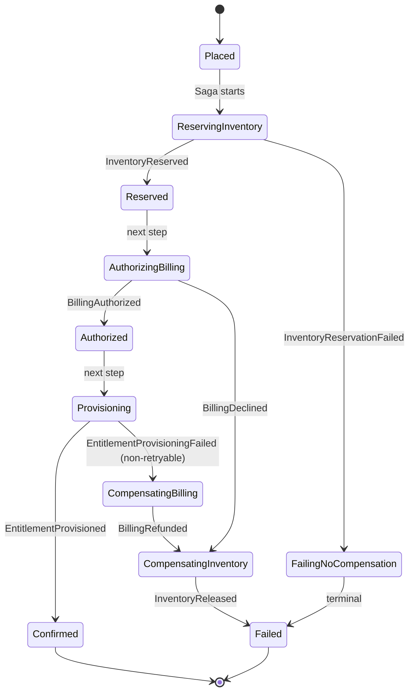

# Saga Design — PlaceOrderSaga

## Why orchestration (not choreography)

- Flow spans 3+ services with branching paths per benefit type.
- Compensation logic (LIFO rollback) is easier to reason about in one place.
- Operational visibility: one orchestrator = one place to ask "where is this order stuck?"
- Choreography is elegant for 2-step pipelines; it becomes "where did this event go?" at 4+ hops.

---

## Saga state machine



---

## Saga step table

| Step | Command | Success reply | Failure reply | Timeout | Retry policy | Compensation |
|---|---|---|---|---|---|---|
| 1. Reserve Inventory | `inventory.Reserve.v1` | `InventoryReserved` | `InventoryReservationFailed` | 10 s | 3× exp backoff (1s, 2s, 4s) — no-response only | `inventory.Release.v1` |
| 2. Authorize Billing | `billing.Authorize.v1` | `BillingAuthorized` | `BillingDeclined` | 15 s | 3× exp — technical errors only; decline is terminal, no retry | No-op (pre-capture) |
| 3. Provision Entitlement | `ott.Provision.v1` (via REST adapter) | `EntitlementProvisioned` | `EntitlementProvisioningFailed` | 30 s | 5× exp up to 60 s; honor `Retry-After` if present | `ott.Revoke.v1` |
| 4. Capture Billing | `billing.Capture.v1` | `BillingCaptured` | (rare) | 15 s | 5× exp | `billing.Refund.v1` |

**Compensation order: strict LIFO.** If provisioning fails → refund billing → release inventory. Each compensation is recorded as a distinct event in the order aggregate.

**Why split Authorize vs Capture:** two-phase billing. Authorization before provisioning reserves the amount without charging. If provisioning fails post-authorization, no money has moved → no refund needed. Capturing after provisioning succeeds simplifies the failure matrix.

---

## Command envelope (Saga → Participant)

```json
{
  "commandId": "uuid",
  "commandType": "inventory.Reserve.v1",
  "sagaId": "saga_01H...",
  "stepId": "step_1",
  "replyTo": "replies.order-service",
  "payload": {}
}
```

**Dedupe contract for every participant:** `(sagaId, stepId)` is the idempotency key. Participants persist a `processed_messages` table and short-circuit on replay. This makes Kafka's at-least-once delivery safe.

---

## Retry semantics — the important distinction

| Type | What triggers it | stepId changes? | Why |
|---|---|---|---|
| Network retry (timeout, no reply) | Saga re-sends same command | No | Same logical attempt; participant dedupes |
| Business retry (transient `retryable=true` failure) | New attempt after backoff | Yes (incremented) | Distinct attempt; audit trail shows each try separately |
| Business decline (permanent) | Immediate compensation | N/A | No retry |

Mixing network and business retry is the #1 way Saga implementations corrupt state under load.

---

## Failure mode catalog

| Failure | Detection | Response |
|---|---|---|
| Participant timeout | Step timeout fires | Retry per policy → compensate if exhausted |
| Kafka redelivery of command | `(sagaId, stepId)` lookup in `processed_messages` | Return prior result; no-op |
| Saga orchestrator crash | Last appended event in ES | On restart, replay aggregate → orchestrator resumes, re-issues outstanding command (participant dedupes) |
| Third-party (OTT) 5xx storm | `retryable=true` repeated failures | Circuit breaker on REST adapter → fail fast → compensate |
| Inventory race (two orders, one seat) | `InventoryReservationFailed` from participant | Saga compensates, order fails |
| Entitlement duplicate (projection lag) | OTT provisioning returns `409` | Non-retryable → compensate |
| Compensation failure | Compensation step times out | Alert + manual intervention; Saga stays in `COMPENSATING_*` state |
