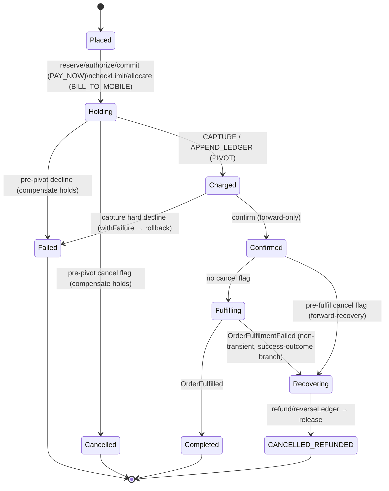

# Saga Design — PlaceOrderSaga

## Why orchestration (not choreography)

- Flow spans 3+ services with branching paths per benefit type.
- Compensation logic (LIFO rollback) is easier to reason about in one place.
- Operational visibility: one orchestrator = one place to ask "where is this order stuck?"
- Choreography is elegant for 2-step pipelines; it becomes "where did this event go?" at 4+ hops.

> **Product-types redesign (Design/09).** The saga stays **one linear orchestrator**.
> A **single `fulfil` step** keeps it product-type-agnostic: instead of an OTT-specific
> provision step, one `fulfilment.Fulfil.v1` command goes to a dedicated
> **fulfilment-service** that dispatches by `productType` internally (shipment /
> entitlement / activation key). New product types change a participant, never this saga.

> **Payment-method flows (DD-23; pivot + recovery revised by DD-26).** One linear saga
> carries **two flows selected by a `billingMode` predicate** — steps not matching the
> order's mode are skipped:
> - **`PAY_NOW`:** reserve → authorize → commit → `[cancel?]` → **CAPTURE (pivot)** →
>   confirm → `[cancel?]` → fulfil → *(refund → release)* → finalize
>   (a two-phase inventory hold + two-phase card billing).
> - **`BILL_TO_MOBILE`:** checkAccountLimit → allocate → `[cancel?]` →
>   **APPEND_LEDGER (pivot)** → confirm → `[cancel?]` → fulfil →
>   *(reverseLedger → release)* → finalize (a one-step inventory hold + postpaid ledger).
>
> All three product types are **finite** (DD-23), so the inventory hold runs for every
> order. **The pivot is the charge** (`capture` for PAY_NOW, `appendLedger` for
> BILL_TO_MOBILE) and the order is **`CONFIRMED` immediately after it**. Steps up to the
> pivot compensate LIFO on failure (terminal **`FAILED`**); steps after it are
> **forward-only** — Eventuate has no auto-retry, so a post-pivot problem is handled by an
> explicit **forward-recovery** branch (refund/reverse the charge → release inventory →
> terminal **`CANCELLED_REFUNDED`**), never a rollback (DD-26).
>
> **A PAY_NOW hard capture decline is the pivot failing to commit** — it replies
> `withFailure`, the holds roll back, and the order ends `FAILED` (nothing captured → no
> refund). The DD-24 `CAPTURE_FAILED` hold state is **retired**.
>
> **User cancel is cooperative** (`POST /{id}/cancel` flags the order; 202): the saga
> reads the flag at two checkpoints — **pre-pivot** → roll back to `CANCELLED`;
> **pre-fulfil** (post-pivot) → forward-recover to `CANCELLED_REFUNDED`. After fulfilment
> / once `COMPLETED`, cancel is refused (409). Terminal success is `COMPLETED`;
> `CONFIRMED` is an intermediate milestone.

---

## Saga state machine



> The **pivot is the charge**. Everything before it compensates LIFO (→ `FAILED`, or
> `CANCELLED` on a pre-pivot cancel). Everything after is **forward-only**: a
> non-transient fulfilment failure or a pre-fulfil cancel flips to **forward-recovery**
> (refund/reverse + release → `CANCELLED_REFUNDED`) rather than rolling back. A hard
> capture decline is the pivot itself failing — it replies `withFailure` and rolls back
> to `FAILED` (nothing charged → no refund).

---

## Saga step table

One linear 15-step saga; the `Mode`/`When` column shows which `billingMode` (or
forward-recovery condition) runs each step. Steps before the pivot have compensations
(LIFO); the pivot is the charge; everything after it is forward-only (DD-26).

| # | Step | When | Command / local | Success reply | Failure reply | Compensation |
|---|---|---|---|---|---|---|
| 1 | Reserve Inventory | PAY_NOW | `inventory.Reserve.v1` | `InventoryReserved` | `InventoryReservationFailed` → `FAILED` | `inventory.Release.v1` |
| 2 | Check Account Limit | BILL_TO_MOBILE | `billing.CheckAccountLimit.v1` | `AccountLimitOk` | `AccountLimitExceeded` → `FAILED` | No-op (nothing held yet) |
| 3 | Allocate Inventory | BILL_TO_MOBILE | `inventory.Allocate.v1` | `InventoryAllocated` | `InventoryAllocationFailed` → `FAILED` | `inventory.Release.v1` |
| 4 | Authorize Billing | PAY_NOW | `billing.Authorize.v1` | `BillingAuthorized` | `BillingDeclined` → `FAILED` | No-op (pre-capture) |
| 5 | Commit Inventory | PAY_NOW | `inventory.Commit.v1` | `InventoryCommitted` | `InventoryCommitFailed` → `FAILED` | `inventory.Release.v1` |
| 6 | **Pre-pivot cancel checkpoint** | both | *(local)* | — | flag set → `cancel()` + `SagaRollback` (compensate holds → `CANCELLED`) | — |
| 7 | **Capture Billing (PIVOT, PAY_NOW)** | PAY_NOW | `billing.Capture.v1` | `BillingCaptured` | `BillingCaptureFailed` **withFailure** → rollback → `FAILED` | — (pivot) |
| 8 | **Append Ledger (PIVOT, BTM)** | BILL_TO_MOBILE | `billing.AppendToLedger.v1` | `LedgerAppended` | — | — (pivot, forward-only) |
| 9 | Confirm Order | both | *(local)* — publishes `OrderConfirmed` | — | — | — (forward-only) |
| 10 | **Pre-fulfil cancel checkpoint** | both | *(local)* | — | flag set → `forwardRecover = true` (no throw) | — |
| 11 | Fulfil Order | `!forwardRecover` | `fulfilment.Fulfil.v1` | `OrderFulfilled` | `OrderFulfilmentFailed` **withSuccess** → `forwardRecover = true` | — (forward-only) |
| 12 | Refund (forward-recovery) | PAY_NOW && `forwardRecover` | `billing.Refund.v1` | `BillingRefunded` | — | — |
| 13 | Reverse Ledger (forward-recovery) | BTM && `forwardRecover` | `billing.ReverseLedger.v1` | `LedgerReversed` | — | — |
| 14 | Release Inventory (forward-recovery) | `forwardRecover` | `inventory.Release.v1` | — | — | — |
| 15 | Finalize Order | both | *(local)* | — | — | — |

> **Pivot = the charge (DD-26).** `capture` (PAY_NOW, step 7) / `appendLedger` (BTM,
> step 8) is the go/no-go point; `confirm` (step 9) fires right after, so a published
> `OrderConfirmed` is never compensated away. Eventuate has **no auto-retry**: a
> `withFailure` reply *always* compensates. So a hard capture decline replies
> `withFailure` and **rolls back** to `FAILED` (nothing captured → no refund), while
> post-pivot steps must reply `withSuccess` only — "forward-only" is enforced by coding
> discipline, not by the framework.

> **Forward-recovery, not rollback (DD-26).** A non-transient fulfilment failure
> (success-outcome `OrderFulfilmentFailed`) or a pre-fulfil cancel sets `forwardRecover`.
> The saga then moves *forward*: refund (PAY_NOW) / reverseLedger (BTM) → release
> inventory → `finalize` publishes `OrderCancelledRefunded` (terminal
> **`CANCELLED_REFUNDED`**). On the happy path `forwardRecover` is false, steps 12–14 are
> predicated off, and `finalize` publishes `OrderCompleted`.

> **Cancel checkpoints (DD-26).** `POST /{id}/cancel` only flags the order (`202`); the
> saga decides at step 6 (pre-pivot → roll back to `CANCELLED`) or step 10 (post-pivot →
> forward-recover to `CANCELLED_REFUNDED`). A flag that lands after step 10 passes loses
> the race; the order completes and the API returns `409` once terminal.

**Single fulfil step, internal dispatch.** Step 11 sends one command regardless of
type; fulfilment-service routes by `productType` (shipment → `trackingRef`,
entitlement → `externalRef`, license → echo the `activationKey`). The resolved
artifact rides back on `OrderFulfilled` and is stamped onto `OrderCompleted`.

**Compensation order: strict LIFO, up to the pivot.** PAY_NOW: authorize-decline →
release reservation; capture decline → release reservation. BILL_TO_MOBILE: check-limit
failure → nothing to undo; allocation failure → release. Past the pivot there is no
compensation — the unwind is the forward-recovery tail (steps 12–14).

**Why two-phase per flow.** PAY_NOW reserves inventory and authorizes the card before
committing/confirming, so a decline rolls back a temporary hold with no money moved.
BILL_TO_MOBILE checks the postpaid limit *before* allocating, so an over-limit or
suspended account fails before any resource is held. Either way `confirm` only fires
once the order is guaranteed to settle.

---

## Command envelope (Saga → Participant)

```json
{
  "commandId": "uuid",
  "commandType": "inventory.Reserve.v1",
  "sagaId": "saga_01H...",
  "stepId": "step_1",
  "replyTo": "replies.order-service",
  "payload": {}
}
```

**Dedupe contract for every participant:** `(sagaId, stepId)` is the idempotency key. Participants persist a `processed_messages` table and short-circuit on replay. This makes Kafka's at-least-once delivery safe.

---

## Retry semantics — the important distinction

| Type | What triggers it | stepId changes? | Why |
|---|---|---|---|
| Network retry (timeout, no reply) | Saga re-sends same command | No | Same logical attempt; participant dedupes |
| Business retry (transient `retryable=true` failure) | New attempt after backoff | Yes (incremented) | Distinct attempt; audit trail shows each try separately |
| Business decline (permanent) | Immediate compensation | N/A | No retry |

Mixing network and business retry is the #1 way Saga implementations corrupt state under load.

---

## Failure mode catalog

| Failure | Detection | Response |
|---|---|---|
| Participant timeout | Step timeout fires | Retry per policy → compensate if exhausted |
| Kafka redelivery of command | `(sagaId, stepId)` lookup in `processed_messages` | Return prior result; no-op |
| Saga orchestrator crash | Last appended event in ES | On restart, replay aggregate → orchestrator resumes, re-issues outstanding command (participant dedupes) |
| Third-party (OTT) 5xx storm | `retryable=true` repeated failures | Circuit breaker on REST adapter → fail fast → compensate |
| Inventory race (two orders, one seat) | `InventoryReservationFailed` from participant | Saga compensates, order fails |
| Entitlement duplicate (projection lag) | OTT provisioning returns `409` | Non-retryable → compensate |
| PAY_NOW capture hard-declined (DD-26) | `BillingCaptureFailed` **withFailure** at the pivot | Pivot failed to commit → nothing captured → LIFO rollback of the holds → terminal `FAILED` (no refund). `CAPTURE_FAILED` is retired |
| Non-transient fulfil failure (DD-26) | `OrderFulfilmentFailed` **withSuccess** (route closed, damaged, no key) | No rollback: set `forwardRecover` → refund/reverseLedger → release → terminal `CANCELLED_REFUNDED` |
| Compensation failure | Compensation step times out | Alert + manual intervention; Saga stays in `COMPENSATING_*` state |
