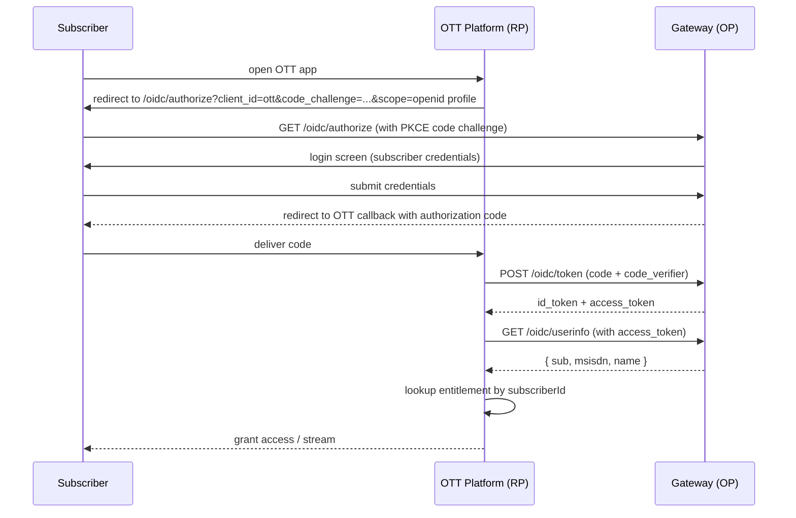
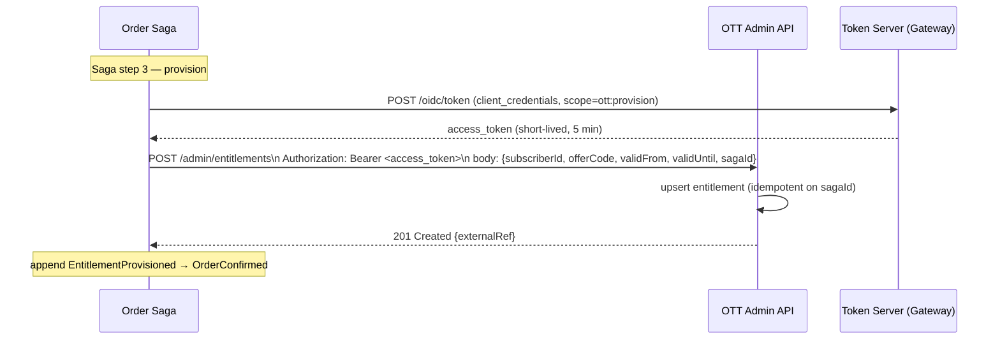

# OTT Platform — Auth & Integration Design

## The two problems (distinct, often conflated)

| Problem | Question | Solution |
|---|---|---|
| **Federated login** | How does a subscriber authenticate *to the OTT platform* using their telco identity? | OIDC — Authorization Code + PKCE |
| **Entitlement provisioning** | How does VA-BAGS tell the OTT platform that a subscriber has purchased access? | REST API call from Order Saga, secured by OAuth2 client credentials |

These are independent flows. Conflating them (e.g., trying to provision via the user's access token) is a common design mistake.

---

## Why OIDC, not plain OAuth2 or SAML

| Option | Verdict | Reason |
|---|---|---|
| SAML | Skip | XML-heavy, browser-redirect-only, designed for enterprise workforce IdPs. Clunky for consumer mobile-first scenario. |
| Plain OAuth2 | Insufficient | Delegated *authorization* only — says nothing about who the user is. |
| **OIDC (OAuth2 + identity layer)** | **Chosen** | Adds `id_token` (JWT proving identity) on top of OAuth2. Standard consumer SSO pattern. Telco = OpenID Provider (OP). OTT = Relying Party (RP). |

**Flow: Authorization Code + PKCE**
- PKCE because mobile/public clients cannot safely store a client secret.
- Code flow (not implicit) because tokens are never exposed in the browser URL fragment.

---

## OIDC login flow (subscriber → OTT)



**id_token claims:**
```json
{
  "sub": "sub_...",
  "msisdn_hash": "sha256(msisdn)",
  "name": "Subscriber Name",
  "iss": "https://vab.example.com",
  "aud": "ott-client-id",
  "iat": 1234567890,
  "exp": 1234571490
}
```
`msisdn` is hashed in the token — OTT does not get raw MSISDN unless explicitly scoped.

---

## Entitlement provisioning flow (Order Saga → OTT)



Token is cached in the Saga adapter for its lifetime. Not re-fetched per request.

**Compensation (revoke):**
```
DELETE /admin/entitlements/{externalRef}
Authorization: Bearer <access_token>
```
Idempotent — returns `200` even if already revoked.

---

## OTT platform scope (what it does and doesn't do)

**Does:**
- Serve a small video catalog (title, description, stream URL).
- `GET /v1/videos` — search/browse.
- `GET /v1/videos/{id}/stream` — returns stream URL, gated on local entitlement check.
- Maintain local entitlement table: `(subscriberId, offerCode, status, validFrom, validUntil, externalRef)`.

**Does not:**
- Manage subscriber identity (only OIDC RP).
- Handle payments.
- Know about VA-BAGS internals.

---

## Implementation note

**Self-hosted Keycloak** is the OIDC OP (DD-29) — a full open-source IdP (realms, user store + self-service registration, login/consent UI, credential flows, admin console) behind standard OIDC discovery/JWKS, not a hand-rolled JWT issuer. **`api-gateway` is not the OP**: it stays **Spring Cloud Gateway** as the edge resource server that validates Keycloak-issued tokens and relays them downstream. The OP endpoints are therefore Keycloak's realm endpoints (`/realms/vab/protocol/openid-connect/{auth,token,userinfo,certs}` + discovery), not `/oidc/*` on the gateway — the flows sketched above are unchanged in shape; only the OP host differs.

### As-built (§A-2)

ott-service is a backend with no video UI, so it plays the RP as a **server-side Spring `oauth2Login` client** rather than a SPA:

- **Login** — public Keycloak client `vab-ott` (Authorization Code + **PKCE**, `S256`). The browser hits any `/v1/videos/**` path, Spring redirects to Keycloak, and the callback (`/login/oauth2/code/keycloak`) establishes a **session**. No client secret (public client ⇒ Spring auto-applies PKCE).
- **Identity → entitlement** — the `subscriberId` claim (Keycloak *user-attribute* mapper) identifies the subscriber; streaming is gated against ott-service's own `entitlements` table (`existsBySubscriberIdAndOfferCodeAndStatus(…, ACTIVE)`). The seeded demo user `alice` carries `subscriberId=sub-alice`.
- **Video surface** — `GET /v1/videos` lists a seeded catalog; `GET /v1/videos/{id}/stream` returns **`"Playing video: <title>"`** when entitled, **403** otherwise, **404** for an unknown id. There is no real media — "stream" is a success message.
- **Two filter chains** — the §A-1 provisioning API (`/ott/v1/entitlements/**`) stays a **Bearer resource server** (`@Order(1)`); the subscriber surface is the **login client** (`@Order(2)`). One service, both OAuth2 roles.

The provisioning flow (Order Saga → OTT) is unchanged — it remains the client-credentials path from §A-1/A-4 (the live route is `POST /ott/v1/entitlements`, not `/admin/entitlements`).
