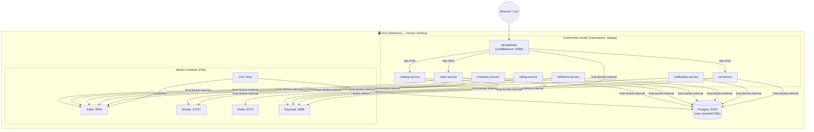

# Deployment — Local Kubernetes (phased plan)

**Goal.** Learn Kubernetes *hands-on* by deploying VA-BAGS to a **local single-node cluster**, at the depth a **developer** (not a full-time SRE) needs for day-to-day work and interviews. Each phase is runnable on its own; complex objects get a 1–2 line explainer inline.

**Decisions (locked for this plan):**
- **Cluster:** start with **Docker Desktop Kubernetes** (one checkbox, images from the local Docker daemon need no registry). Revisit **minikube** later for addons (ingress, dashboard, metrics-server).
- **Scope (phased):** **Phase 1** puts the **8 app deployables** in k8s; **Kafka, Mongo, Redis, Keycloak, CDC, Apicurio stay in docker-compose**; **Postgres stays on the host**. **Phase 4** migrates infra into k8s.
- **Images:** hand-written **multi-stage Dockerfile** (build → layer-extract → slim JRE runtime, non-root).

> **Glossary note.** Terms are defined the first time they appear and collected in [§9](#9-concepts-primer-keep-this-open). If a word is unfamiliar, jump there first.

---

## 0. Target picture — what runs where



**Two kinds of dependency** — this distinction is the heart of the whole exercise:

| From a pod, to reach… | Use | Why |
|---|---|---|
| **Another app pod** (gateway→order, order→catalog, fulfilment→ott) | **k8s Service DNS** — `http://order-service:8081` | Both live in the cluster; k8s gives every Service an internal DNS name. |
| **Host / compose infra** (Postgres, Kafka, Mongo, Redis, Keycloak) | **`host.docker.internal:<port>`** | These are *outside* the cluster; Docker Desktop resolves `host.docker.internal` from pods to the host. |

### Dependency matrix (confirmed against each `application.yml`)

| Service | Port | Postgres | Kafka | Mongo | Redis | Keycloak | Calls (in-cluster) |
|---|---|:-:|:-:|:-:|:-:|:-:|---|
| api-gateway | 8089 | – | – | – | – | ✓ JWKS | → order, catalog, ott, … |
| order-service | 8081 | ✓ | ✓ | ✓ `vab` | – | ✓ RS | → catalog (`CatalogClient`) |
| inventory-service | 8082 | ✓ | ✓ | – | – | – | – |
| billing-service | 8083 | ✓ | ✓ | – | – | – | – |
| fulfilment-service | 8086 | ✓ | ✓ | – | – | ✓ M2M | → ott (`OttClient`) |
| notification-service | 8084 | ✓ | ✓ | – | – | – | – |
| catalog-service | 8085 | – | – | ✓ `vab_catalog` | ✓ | – | – |
| ott-service | 8087 | ✓ | – | – | – | ✓ RS+login | – |

*(RS = OAuth2 resource server; M2M = client-credentials.)*

---

## 1. Roadmap at a glance

| Phase | Outcome | New concepts |
|---|---|---|
| **1. Containerize** | A Docker image per service, run-tested standalone | multi-stage build, layered jars, image tags |
| **2. Deploy to k8s** | All 8 services running as Pods, gateway reachable from the browser | Namespace, Deployment, Service, ConfigMap, Secret, probes, resources |
| **3. Day-2 basics** | Scale, rolling update, read logs, change config live | ReplicaSet, rollout, `kubectl` workflow, (optional) Ingress |
| **4. Infra → k8s** *(later)* | Kafka/Mongo/Redis/Keycloak inside the cluster | StatefulSet, PVC, headless Service, init-containers |
| **5. CI/CD** *(later)* | Push-to-deploy pipeline | GitHub Actions, image registry, Kustomize/Helm |

Phases 1–3 are the core of this document; 4–5 are outlined so you know where it's heading.

---

## 2. Phase 1 — Containerize the services

**A container image** = your app + its runtime (JRE) frozen into a portable, layered filesystem. **Multi-stage** = use a fat "builder" image to compile, then copy only the result into a small "runtime" image, so the shipped image stays lean.

### 2.1 One Dockerfile for all services
Because this is a Maven multi-module repo, a **single parameterized Dockerfile** at the repo root builds every service — you pass the module name at build time. Create `Dockerfile`:

```dockerfile
# ---------- stage 1: build the reactor (only the target module + its deps) ----------
FROM maven:3.9-eclipse-temurin-17 AS build
WORKDIR /workspace
COPY . .
ARG MODULE
# -pl <module> -am = "this module and also make the modules it depends on"
RUN mvn -q -pl ${MODULE} -am -DskipTests clean package

# ---------- stage 2: crack the layered jar open (better Docker caching) ----------
FROM eclipse-temurin:17-jre AS layers
WORKDIR /app
ARG MODULE
COPY --from=build /workspace/${MODULE}/target/*.jar app.jar
# Spring Boot layered jars split deps (rarely change) from your code (changes often)
RUN java -Djarmode=layertools -jar app.jar extract

# ---------- stage 3: tiny runtime image ----------
FROM eclipse-temurin:17-jre
WORKDIR /app
RUN useradd -r -u 1001 spring          # never run as root
COPY --from=layers /app/dependencies/          ./
COPY --from=layers /app/spring-boot-loader/     ./
COPY --from=layers /app/snapshot-dependencies/  ./
COPY --from=layers /app/application/            ./
USER 1001
ENTRYPOINT ["java","org.springframework.boot.loader.launch.JarLauncher"]
```

> **Why the layer split?** Docker caches image layers. Your `dependencies/` layer (Maven deps) only changes when you touch `pom.xml`; your `application/` layer changes every commit. Splitting them means a code change re-uploads a few KB, not 60 MB of libraries. Common interview question.

Add a `.dockerignore` (keeps build context small & fast):
```
**/target
**/.git
**/.settings
**/*.iml
Design
deploy/observability/*.txt
```

### 2.2 Build the images
Docker Desktop's Kubernetes shares the **same Docker daemon**, so an image you `docker build` is *immediately visible* to the cluster — **no registry, no push** needed in Phase 1.

```bash
# from repo root; tag = vabags/<service>:dev
for s in api-gateway order-service inventory-service billing-service \
         fulfilment-service notification-service catalog-service ott-service; do
  docker build --build-arg MODULE=$s -t vabags/$s:dev .
done
```
*(PowerShell: `foreach ($s in @('api-gateway','order-service',...)) { docker build --build-arg MODULE=$s -t vabags/$s:dev . }`)*

### 2.3 Smoke-test one container before k8s
Run one image against the *host* infra to prove the image itself works:
```bash
docker run --rm -p 8082:8082 \
  -e SPRING_DATASOURCE_URL=jdbc:postgresql://host.docker.internal:5432/vab \
  -e EVENTUATELOCAL_KAFKA_BOOTSTRAP_SERVERS=host.docker.internal:9094 \
  vabags/inventory-service:dev
# → in another shell: curl http://localhost:8082/actuator/health  ⇒ {"status":"UP"}
```
If that's green, the image is good and the rest is pure Kubernetes.

---

## 3. Phase 2 — Deploy the apps to Kubernetes

### 3.1 Turn the cluster on
1. Docker Desktop → **Settings → Kubernetes → Enable Kubernetes → Apply**. Wait for the green "Kubernetes running".
2. `kubectl` ships with Docker Desktop. Verify:
   ```bash
   kubectl config use-context docker-desktop
   kubectl get nodes        # ⇒ one node, STATUS Ready
   ```
3. Create a **namespace** (a logical partition of the cluster, so VA-BAGS objects don't mix with anything else):
   ```bash
   kubectl create namespace vabags
   kubectl config set-context --current --namespace=vabags
   ```

### 3.2 The networking model (read this before writing YAML)
Everything you wire up follows the **two-kinds-of-dependency** rule from §0:
- **Pod → pod:** use the **Service name**. A `Service` named `order-service` is reachable cluster-wide at `order-service` (same namespace) or `order-service.vabags.svc.cluster.local` (fully qualified). k8s runs an internal DNS for this.
- **Pod → host/compose:** use **`host.docker.internal`**. It resolves to your Windows host from inside Docker Desktop pods.

### 3.3 Two cross-boundary gotchas (the real learning)
These bite *every* hybrid (apps-in-k8s + infra-outside) setup — great to be able to explain.

**(a) Kafka advertised listeners.** A Kafka client connects to a *bootstrap* address, then Kafka replies "actually, talk to me at my **advertised** address." Today Kafka advertises `EXTERNAL://localhost:9094` (fine for host apps). A pod that bootstraps to `host.docker.internal:9094` would be told "go to `localhost:9094`" → `localhost` inside the pod is the pod itself → **connection fails**.
*Fix (cleanest): add a dedicated listener for the cluster* in `docker-compose.yml`:
```yaml
# kafka service — add a K8S listener advertised as host.docker.internal
KAFKA_LISTENERS:            "INTERNAL://0.0.0.0:9092,EXTERNAL://0.0.0.0:9094,K8S://0.0.0.0:9095,CONTROLLER://0.0.0.0:9093"
KAFKA_ADVERTISED_LISTENERS: "INTERNAL://kafka:9092,EXTERNAL://localhost:9094,K8S://host.docker.internal:9095"
KAFKA_LISTENER_SECURITY_PROTOCOL_MAP: "INTERNAL:PLAINTEXT,EXTERNAL:PLAINTEXT,K8S:PLAINTEXT,CONTROLLER:PLAINTEXT"
# ...and publish it:  ports: [ "9095:9095" ]
```
Pods then use `EVENTUATELOCAL_KAFKA_BOOTSTRAP_SERVERS=host.docker.internal:9095`; host apps keep `localhost:9094` unchanged. *(Simpler alternative: just rename EXTERNAL's advertised host to `host.docker.internal:9094` and add `127.0.0.1 host.docker.internal` to your Windows hosts file so host tools still resolve it.)*

**(b) Keycloak issuer must be one stable URL.** A JWT's `iss` (issuer) claim is baked from the URL Keycloak was *reached at*. If pods validate against `http://host.docker.internal:8088/...` but the browser logs in via `http://localhost:8088/...`, the issuers differ and **token validation fails**. Pin one hostname:
```yaml
# keycloak service in docker-compose.yml
KC_HOSTNAME: http://host.docker.internal:8088
```
Then use `http://host.docker.internal:8088/realms/vab` **everywhere** (pods *and* the `KEYCLOAK_ISSUER` env), and add `127.0.0.1 host.docker.internal` to your Windows hosts file so the browser can reach it too. One issuer, no mismatch.

### 3.4 Config: ConfigMap + Secret
- **ConfigMap** = non-secret config as key/value, injected as env vars or files. **Secret** = same idea for sensitive values (base64-encoded at rest; use RBAC in real clusters).

`k8s/config.yaml` — shared endpoints (note: all the "outside" deps point at `host.docker.internal`):
```yaml
apiVersion: v1
kind: ConfigMap
metadata: { name: vabags-endpoints, namespace: vabags }
data:
  SPRING_DATASOURCE_URL: jdbc:postgresql://host.docker.internal:5432/vab
  SPRING_DATA_MONGODB_URI: mongodb://host.docker.internal:27017/vab
  SPRING_DATA_REDIS_HOST: host.docker.internal
  EVENTUATELOCAL_KAFKA_BOOTSTRAP_SERVERS: host.docker.internal:9095
  KEYCLOAK_ISSUER: http://host.docker.internal:8088/realms/vab
---
apiVersion: v1
kind: Secret
metadata: { name: vabags-db, namespace: vabags }
type: Opaque
stringData:                      # stringData = plaintext in, k8s base64-encodes for you
  SPRING_DATASOURCE_USERNAME: eventuate
  SPRING_DATASOURCE_PASSWORD: eventuate
```

### 3.5 A Deployment + Service (order-service as the template)
- **Pod** = one running instance (one or more containers that share a network/IP). You rarely create Pods directly.
- **Deployment** = "keep N identical Pods of this image running, and roll them safely on update." It manages a **ReplicaSet** (the thing that actually maintains the N).
- **Service** = a *stable* virtual IP + DNS name in front of a Deployment's Pods (Pods are ephemeral; their IPs change — the Service name doesn't).

`k8s/order-service.yaml`:
```yaml
apiVersion: apps/v1
kind: Deployment
metadata: { name: order-service, namespace: vabags }
spec:
  replicas: 1
  selector: { matchLabels: { app: order-service } }
  template:
    metadata: { labels: { app: order-service } }
    spec:
      containers:
        - name: order-service
          image: vabags/order-service:dev
          imagePullPolicy: IfNotPresent      # use the local daemon image; don't pull from a registry
          ports: [ { containerPort: 8081 } ]
          envFrom:
            - configMapRef: { name: vabags-endpoints }
            - secretRef:    { name: vabags-db }
          # health probes: k8s asks the app "are you alive / ready for traffic?"
          readinessProbe:                     # ready=false ⇒ removed from Service until UP (no traffic to a booting pod)
            httpGet: { path: /actuator/health/readiness, port: 8081 }
            initialDelaySeconds: 20
            periodSeconds: 5
          livenessProbe:                      # liveness=false ⇒ k8s restarts the pod (deadlock recovery)
            httpGet: { path: /actuator/health/liveness, port: 8081 }
            initialDelaySeconds: 40
            periodSeconds: 10
          resources:                          # requests = scheduler reservation; limits = hard ceiling
            requests: { cpu: "250m", memory: "512Mi" }
            limits:   { memory: "768Mi" }
---
apiVersion: v1
kind: Service
metadata: { name: order-service, namespace: vabags }
spec:
  selector: { app: order-service }            # routes to Pods with label app=order-service
  ports: [ { port: 8081, targetPort: 8081 } ] # type defaults to ClusterIP (in-cluster only)
```

> **Enable the probe endpoints.** Spring Boot serves `/actuator/health/liveness` & `/readiness` when the health group probes are on. Add to each service (or a shared profile): `management.endpoint.health.probes.enabled: true` and keep `health` in the actuator exposure (already the case here). On a memory-tight box, start with generous `initialDelaySeconds` so slow boots don't get killed.

The other six back-end services are **the same file with name/image/port swapped**. Put per-service overrides (e.g. `KEYCLOAK_TOKEN_URI` for fulfilment, the `mongodb://…/vab_catalog` URI for catalog) as extra `env:` entries on that Deployment.

### 3.6 Expose the gateway to your browser
Back-end Services are `ClusterIP` (internal only) — correct, they should only be reached *through* the gateway. The gateway itself needs to be reachable from the host. On Docker Desktop, a **LoadBalancer** Service is published on `localhost`:
```yaml
apiVersion: v1
kind: Service
metadata: { name: api-gateway, namespace: vabags }
spec:
  type: LoadBalancer                # Docker Desktop maps this to localhost:<port>
  selector: { app: api-gateway }
  ports: [ { port: 8089, targetPort: 8089 } ]
```
Then `https://localhost:8089/...` hits the gateway. *(Portable alternative that works on any cluster: `kubectl port-forward svc/api-gateway 8089:8089`.)*

> **One config change in the gateway itself:** its downstream route targets (and the `CatalogClient` / `OttClient` base-URLs in order/fulfilment) currently say `http://localhost:808x`. In-cluster those must become the **Service DNS** names — `http://order-service:8081`, `http://catalog-service:8085`, `http://ott-service:8087`. Override them via env/ConfigMap on those Deployments (same relaxed-binding trick as the datastore URLs).

### 3.7 Apply & verify
```bash
kubectl apply -f k8s/config.yaml
kubectl apply -f k8s/            # applies every manifest in the folder
kubectl get pods -w             # watch them go ContainerCreating → Running → READY 1/1
kubectl logs deploy/order-service -f          # tail logs
curl -k https://localhost:8089/actuator/health
# then run a real order through the gateway exactly like the e2e path
```
Green health + a completed saga = Phase 2 done.

---

## 4. Phase 3 — Day-2 basics (the developer's kubectl loop)

- **Scale:** `kubectl scale deploy/order-service --replicas=3` → the ReplicaSet spins up 3 Pods; the Service load-balances across them. *(Note: with the transactional-outbox saga, extra replicas share the same Postgres/Kafka — fine for throughput, and a nice way to see Service load-balancing.)*
- **Rolling update:** rebuild the image (`:dev` again or a new tag), then `kubectl rollout restart deploy/order-service`. k8s starts new Pods, waits for **readiness**, then retires old ones — zero downtime. `kubectl rollout status` / `kubectl rollout undo` to watch or revert.
- **Change config live:** edit the ConfigMap → `kubectl rollout restart` the affected Deployments (env is read at boot). *(Real clusters use a checksum annotation to auto-restart on config change.)*
- **Inspect:** `kubectl describe pod <p>` (events, why it won't schedule), `kubectl get events --sort-by=.lastTimestamp`, `kubectl exec -it <pod> -- sh`.
- **(Optional) Ingress** instead of per-service LoadBalancers: one entry point that routes by path/host to Services. Needs an ingress controller (minikube: `minikube addons enable ingress`). Since the app already has an api-gateway, Ingress is optional here — but worth standing up once to learn the object.

---

## 5. Phase 4 *(later)* — move infra into Kubernetes

Motivation: kill the `host.docker.internal` hacks — inside the cluster everything is clean Service DNS. New concepts you'll meet:
- **StatefulSet** — like a Deployment but for stateful pods that need **stable identity + storage** (Postgres, Kafka, Mongo). Pods are `mongo-0`, `mongo-1`… and each keeps its own disk across restarts.
- **PersistentVolumeClaim (PVC)** — a Pod's request for durable disk; survives Pod restarts (Docker Desktop ships a default storage class).
- **Headless Service** (`clusterIP: None`) — gives each StatefulSet Pod its own DNS record (needed by Kafka/Mongo clustering).
- **init-container** — a container that runs to completion *before* the app container (e.g. "wait for Postgres" / run Flyway).

Sensible order: Mongo + Redis first (easy), then Keycloak, then Kafka (hardest — advertised listeners again, but now with in-cluster names). **Postgres can stay on the host** the whole time if you like — that was your call and it's a legitimate pattern (managed DB outside the cluster is common in production too).

---

## 6. Phase 5 *(later)* — CI/CD

Target loop: **push to Git → build & test → build image → push to registry → deploy to cluster.**
- **Registry:** once you leave the single local daemon, images need a home — Docker Hub, GitHub Container Registry (`ghcr.io`), etc. Deployments then reference `ghcr.io/you/order-service:<gitsha>` and need an `imagePullSecret`.
- **Pipeline:** GitHub Actions — a job that runs `mvn verify`, builds the 8 images (matrix build over the module list), pushes them tagged with the commit SHA.
- **Templating:** stop copy-pasting near-identical YAML — **Kustomize** (overlays: `dev`/`prod` patches over a common base; built into `kubectl`) or **Helm** (templated charts + values). Kustomize first (simpler, no templating language).
- **Deploy step:** `kubectl apply -k overlays/dev` (Kustomize) or `helm upgrade`. Later: GitOps (Argo CD watches the repo and reconciles the cluster).

---

## 7. `kubectl` cheat sheet

```bash
kubectl get pods|svc|deploy|cm|secret            # list objects (add -o wide / -A for all namespaces)
kubectl describe pod <name>                       # detail + events (first stop for "why broken")
kubectl logs <pod> [-f] [--previous]              # logs; --previous = the crashed instance
kubectl exec -it <pod> -- sh                      # shell inside a container
kubectl apply -f file.yaml | -k dir/              # create/update from manifest(s)
kubectl rollout status|restart|undo deploy/<n>    # manage a rollout
kubectl scale deploy/<n> --replicas=N
kubectl port-forward svc/<n> 8089:8089            # tunnel a Service to localhost (works anywhere)
kubectl get events --sort-by=.lastTimestamp       # cluster-wide recent events
kubectl delete -f k8s/                            # tear down
```

---

## 8. Troubleshooting (symptom → likely cause)

| Symptom | Likely cause / fix |
|---|---|
| Pod `ImagePullBackOff` | Cluster tried to pull from a registry. Set `imagePullPolicy: IfNotPresent`; confirm the image name/tag matches your `docker build -t`. |
| Pod `CrashLoopBackOff` | App exits on boot. `kubectl logs --previous`. Usually a wrong endpoint env or a dep that's down. |
| App can't reach DB/Kafka | Used a Service name for an *outside* dep, or `localhost`. Must be `host.docker.internal:<port>`. |
| Kafka connects then drops | Advertised-listener gotcha (§3.3a) — pod was handed `localhost:9094`. |
| 401 from a valid login | Keycloak issuer mismatch (§3.3b) — pin `KC_HOSTNAME`, one issuer everywhere. |
| Pod `Pending` forever | Not enough CPU/memory to satisfy `requests`. Lower requests or free RAM (you're on a tight box). |
| Readiness never true | Probe path/port wrong, or `initialDelaySeconds` too short for a slow boot. |
| Gateway route 503 | Route target still `localhost:808x` instead of the Service DNS name (§3.6). |

---

## 9. Concepts primer (keep this open)

| Object / term | One-liner |
|---|---|
| **Pod** | Smallest deployable unit: one (or a few) containers sharing an IP & lifecycle. |
| **ReplicaSet** | Keeps *N* identical Pods alive. You don't touch it directly. |
| **Deployment** | Declarative wrapper over ReplicaSets that gives you rolling updates & rollbacks. |
| **Service** | Stable virtual IP + DNS name load-balancing to a set of Pods (Pods come and go). |
| **ClusterIP / NodePort / LoadBalancer** | Service reach: in-cluster only / on a node port / externally (localhost on Docker Desktop). |
| **Ingress** | HTTP router at the edge (path/host → Service); needs an ingress controller. |
| **Namespace** | A scope to group & isolate objects (`vabags`). |
| **ConfigMap / Secret** | Externalized config / sensitive config, injected as env or files. |
| **liveness / readiness / startup probe** | "restart me if dead" / "send me traffic only when ready" / "I boot slowly, wait". |
| **requests / limits** | Scheduler reservation / hard ceiling for CPU & memory. |
| **StatefulSet / PVC / headless Service** | Stable-identity Pods / durable disk / per-Pod DNS — for stateful infra (Phase 4). |
| **`host.docker.internal`** | DNS name that resolves from a pod to the host machine (Docker Desktop). |
| **`imagePullPolicy: IfNotPresent`** | Use the locally-built image; only pull if it's missing. |

---

## 10. Interview crib (things to be able to say out loud)
- *Deployment vs StatefulSet* — stateless & interchangeable vs stable identity + storage.
- *Service vs Ingress* — L4 stable-IP/DNS load-balancer vs L7 HTTP path/host router.
- *liveness vs readiness* — restart-if-dead vs gate-traffic-until-ready; getting these wrong causes crash loops or traffic to half-booted pods.
- *requests vs limits* — and what OOM-kill / CPU-throttle look like.
- *Why layered Docker images* — cache stable deps separately from churny app code.
- *How service discovery works* — kube-dns/CoreDNS gives every Service a name; Pods are found by label selector.
- *Rolling update mechanics* — new ReplicaSet scaled up behind readiness, old scaled down; `rollout undo` for instant rollback.
- *ConfigMap/Secret + the 12-factor "config in the environment"* — why the app has zero hardcoded endpoints.
- *The advertised-listener problem* — a concrete, memorable networking war story.

---

### Open questions for you
1. **Postgres schemas** — the host Postgres currently holds `vab` (+ `eventuate` schema) and `keycloak`; the k8s services just repoint at `host.docker.internal:5432`. Confirm you want it to *stay* host-side through all phases (I've assumed yes).
2. **Namespace-per-env later?** For CI/CD we can use `vabags-dev` / `vabags-staging`. Fine to defer.
3. Want me to actually **generate the `Dockerfile`, `.dockerignore`, and the `k8s/` manifests** as files next (Phase 1–2 executable), or keep this as the reading plan for now?
```
