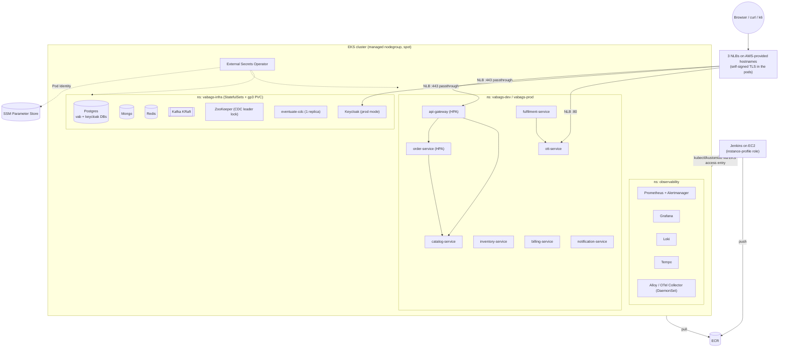

# Full Edition → Flagship: Gap Analysis & Action Plan (incl. EKS + Jenkins CI/CD)

**Goal.** Make the **full** VA-BAGS build (8 services, CQRS + Saga + OIDC + observability) the
project you demo in interviews. It should run on **EKS** and ship through a **Jenkins** pipeline,
reusing what the **Lite** track already proved (tests, JaCoCo/Sonar, ECR/EKS, Jenkins on EC2).

**Inputs.** `Design/vbg_lite_CICD_fork.md`, `vbg_lite_Tests_fork.md`, `lite-cutlist.md`,
`lite-scope-outline.md`, `10-drift-and-backlog.md`, `11-deployment-k8s.md`, plus a file-level diff
of `order|inventory|billing-service` vs `lite-*`, `main` vs `cicdLite`, and the CI/k8s assets.
Verified against code on 2026-09-25 (branch `cicdLite` @ `7723a73` + uncommitted Jenkins work).

---

## ★ Status update, 2026-09-25: Phase 0 done + full CI/CD scaffolding built

**Decisions taken (§10):** (1) **AWS-provided hostnames only**, with no custom domain → public NLBs + **self-signed TLS
terminated in the pods**. (2) Lite stays as a **frozen low-cost variant**. (3) **Kustomize for apps, Helm for vendors**.
(4) **eksctl ClusterConfig in git**. (5) **Apicurio dropped**.

**Fixed (the five "things to fix"):**
| # | Item | What changed |
|---|---|---|
| 1 | Full unit tests red | Deleted the TRACE-DIAG block + OTel imports in `inventory-service/.../InventoryCommandHandlers.java`. `mvn verify` now passes **180 tests, 0 failures** (full) and lite passes 111 |
| 2 | Sonar token in the public repo | `sonar.token`/`sonar.host.url` removed from `pom.xml` (commit `3850345`). **Still to do by you: revoke `sqp_52a0…` in SonarQube and update `.secrets`.** The token remains in git history since `3c0e3db` |
| 3 | Ghost parent / `pom.xml.bkp` | **One root pom** with property-activated profiles: `full` (default, `!lite`) and `lite` (`-Dlite`). `pom.xml.bkp` is deleted. `-Pit`/`-Pe2e` can no longer switch editions by accident. JaCoCo + surefire excludes + `-Pit` failsafe now apply to both editions. Full `*IntegrationTest` renamed to `*IT` (`OrderPersistenceIT`, `NotificationDeliveryIT`). All lite pipelines/docs now pass `-Dlite` |
| 4 | No CI/CD for full | Built. See the file list below |
| 5 | Untracked Jenkins work | Committed in `3850345` |

**Also changed:** `Dockerfile` gains the IST TZ fix (it already ran as non-root `USER spring`; the earlier
"root" note in §2.4 was wrong). The gateway keystore default is no longer a Windows path
(`file:./deploy/tls/gateway-keystore.p12`, alias via `GATEWAY_SSL_KEY_ALIAS`; EC2/EKS set `GATEWAY_SSL_KEYSTORE`
+ `GATEWAY_SSL_KEYSTORE_PASSWORD`). ott-service supports a split-horizon Keycloak (`jwk-set-uri` + an `eks` profile).
E2E Keycloak admin credentials can now be overridden (`-Dvab.keycloak.admin.user/password`). Apicurio is removed from
`docker-compose.yml`/README.

**New files (full edition CI/CD):**
| Path | Purpose |
|---|---|
| `k8s-full/platform/platform.yaml` | `vabags` namespace + **gp3** StorageClass (EBS CSI, WaitForFirstConsumer) |
| `k8s-full/base/*` | 8 services + in-cluster infra: Postgres/Kafka/Mongo as **StatefulSets with gp3 PVCs**, ZooKeeper, CDC (1 replica, Recreate), Redis, **Keycloak in prod mode** (`start`, split-horizon) |
| `k8s-full/overlays/eks/` | base + 3 public **NLB** Services (gateway :443, Keycloak :443, OTT :80) |
| `k8s-full/scripts/deploy.sh` | NLBs → wait for hostnames → `vabags-public` ConfigMap → generated secrets + self-signed TLS (once) → realm rendered with the OTT URL/secret → render + pin images to ECR:sha → apply → ordered rollout waits |
| `k8s-full/scripts/gen-selfsigned-tls.sh` | cert with SANs `*.elb.<region>.amazonaws.com`, `*.<region>.elb…`, `*.<region>.compute…` → Keycloak PEM + gateway PKCS12. Also usable on a plain EC2 host |
| `infra/eks/cluster.template.yaml`, `create-cluster.sh`, `delete-cluster.sh`, `ecr-lifecycle-policy.json` | eksctl spot cluster (no NAT, EBS CSI, access entry for the Jenkins role), ECR repos (scan-on-push, keep 10). Teardown deletes the namespace first so the EBS volumes and NLBs are freed |
| `jenkins/Jenkinsfile.full` | unit + IT → Sonar → gate → 8 images → Trivy (if installed) → ECR (sha tags) → approval → `deploy.sh` → smoke e2e via the public NLBs → rollback on failure. CD only from `main` unless `DEPLOY_ANY_BRANCH` |
| `jenkins/Jenkinsfile.infra` | create/delete the cluster + **nightly 23:00 IST delete** |
| `jenkins/jenkins-full-policy.json` | Jenkins instance-role policy: ECR push/create/lifecycle + `eks:DescribeCluster` |
| `.github/workflows/full-ci.yml` | free PR gate on GitHub: `mvn -Pit verify` (+ optional Sonar) |

**How TLS/OIDC work on AWS-provided hostnames (interview answer):** ACM and Let's Encrypt can't issue a cert
for `*.elb.amazonaws.com` names we don't own. So the NLBs are plain **TCP passthrough**, and the **gateway and
Keycloak terminate TLS themselves** with a self-signed cert (the browser warns once, e2e uses relaxed HTTPS).
Keycloak is **split-horizon**. Browsers use `https://<kc-nlb>`, which is also `KC_HOSTNAME` and therefore every token's `iss`.
Pods use `http://keycloak:8080` for token/JWKS/userinfo; the realm's `sslRequired=external` allows that from VPC IPs.
Resource servers set `jwk-set-uri` (internal) + `issuer-uri` (public), so they validate `iss` with no discovery at boot.
The OTT login client uses explicit endpoints (the browser gets the public authorize URL, the server uses the internal token URL).
The chicken-and-egg problem (URLs only exist after the NLBs do) is solved by `deploy.sh`: it creates the NLBs first and injects the URLs.

**Not run (by request):** no EKS deploy, no dry-run of the manifests or pipelines. Only a render check was done: the overlay renders with
`kubectl kustomize`, and the TLS script produces a keystore Java can read. **Expect first-run fixes**, most likely in: Keycloak prod-mode
boot/probes, the realm import, and NLB provisioning time.

**Next up (plan unchanged):** Phase 1 tests (port `PlaceOrderSagaTest`, gateway security tests), Phase 3 observability
on k8s (Prometheus metrics + Helm charts), then polish.

---

## 0. Verdict in five lines

1. **Lite subtracts features and adds almost none.** It ships no business feature that the full build lacks. What Lite does add is *engineering*: Testcontainers ITs, JaCoCo, Sonar,
   Dockerfile/TZ hardening, kustomize + in-cluster infra, ECR/EKS, GHA + Jenkins pipelines.
   **All of that has to be ported to the full build.**
2. **Observability and OIDC are not removed from the full build.** They are built (§C2 scope C, §A1–A5) but are **opt-in or local-only**: the `obs` profile is off by default, sampling is 0.0, OTLP export is off, the Loki push URL is `localhost`, the Keycloak issuer is `localhost`/`host.k3d.internal`, and the gateway TLS keystore is a Windows path. They have to be **re-platformed for k8s**, not re-coded.
3. **The full build has no CI/CD at all.** It has no workflow, no Jenkinsfile, no `-Pit` profile, no JaCoCo of its own, no image publishing, and only k3d manifests that point at *host* infra.
4. **A few truly open backlog items** make good flagship material: Prometheus metrics (none today), DLQ (C1), Keycloak prod-mode (E3) and externalized secrets (E1). Apicurio runs but nothing uses it.
5. **Hygiene blockers to clear before anyone looks at the repo.** The full build's unit tests are **red** (inventory, §9). A **SonarQube token is committed** in `pom.xml` on the **public** GitHub repo. The full modules inherit the **Lite** parent pom (see §1.3).

---

## 1. Baseline facts (verified)

### 1.1 Footprint
| | Full | Lite |
|---|---|---|
| App services | 8: api-gateway, order, inventory, billing, fulfilment, notification, catalog, ott | 4: api-gateway (`lite` profile), lite-order, lite-inventory, lite-billing |
| Infra | Postgres (host install), Kafka KRaft, ZooKeeper (CDC leader), eventuate-cdc, Mongo, Redis, Keycloak, Apicurio (unused), Loki/Grafana/Tempo (`obs`) | Postgres (container :5433), Kafka KRaft, ZooKeeper (CDC), eventuate-cdc |
| Branch | `main` (pre-lite). `cicdLite` = main + 14 commits | `cicdLite` |

### 1.2 What `cicdLite` changed in *shared/full* code (everything else is additive `lite-*`)
- `api-gateway`: added `LiteSecurityConfig` (`@Profile("lite")`, permitAll), `@Profile("!lite")` on
  `SecurityConfig`, and a `lite` profile block in `application.yml`. **Additive, safe for full.**
- `deploy/postgres-init/04-tram-saga-schema.sql`: **new, and required by the full build too.** Without it
  the orchestrator fails with `relation "eventuate.saga_instance" does not exist` on any fresh Postgres, including k8s/Testcontainers. The full build only worked because the host Postgres already had these tables.
- `e2e-tests/OrderFailurePathsE2E`: unused-import cleanup only.
- Root `pom.xml` became the **Lite** aggregator. The full aggregator moved to `pom.xml.bkp`.

### 1.3 "Ghost parent" (verified with `mvn -f pom.xml.bkp help:effective-pom -pl order-service`)
Full modules declare their parent by GAV with the default `relativePath=../pom.xml`. That file is now the
**Lite** pom, with the same GAV. So **even `mvn -f pom.xml.bkp` builds the full modules with the Lite parent's**
JaCoCo, Testcontainers deps, surefire excludes and the committed `sonar.token`. It works by accident and
is confusing. Fix it in Phase 0 by having one canonical root pom.

### 1.4 Full-build unit tests today
`mvn -f pom.xml.bkp test` (without the `*IntegrationTest` classes, no Docker): **180 tests, 5 errors. The build is red**
because of `inventory-service`: the leftover TRACE-DIAG debug log NPEs in unit tests (details in §9).
`api-gateway` has **zero** tests in both editions.

---

## 2. Gap A: things in Lite that the full build lacks (port **→ full**)

### 2.1 Functional
| Lite item | Port? | Notes |
|---|---|---|
| `LiteOrderQueryController` (reads the Postgres write model) | ❌ No | Full has the Mongo CQRS read side plus a read-your-writes fallback. That is the better story. |
| `X-Subscriber-Id` header identity (auth off) | ❌ No | A security regression. Full derives `subscriberId` from the JWT claim and checks object ownership (404 for non-owners). |
| `CatalogClient` null stub, fulfil `invokeLocal` stub | ❌ No | Lite-only simplifications. |
| `PlaceOrderSaga` step methods made package-private | ✅ Yes | This is what makes `PlaceOrderSagaTest` possible. Apply it to the full saga, including the fulfil handlers. |
| Inventory `if (raw!=null && sc!=null)` guard on the TRACE-DIAG log | ✅ Better: **delete** | `InventoryCommandHandlers.java:76-80` in full still has the *temporary* §C2 TRACE-DIAG log. Remove it. |
| logback `APP_FILE` attached to root (order) | ⚠️ Optional | In k8s you want stdout JSON only. Attach the file appender only when not on k8s. |

**Conclusion: nothing functional needs to come back from Lite.** The saga, including BTM, is identical apart from the fulfil stub.

### 2.2 Tests
| Lite asset | Port action for full |
|---|---|
| `it/AbstractIntegrationTest` (PG 18 + Kafka Testcontainers, pre-seeded eventuate schema `01`+`04`, `withReuse`) | Copy into **every** full service. Extend with a **Mongo** container (order, catalog), **Redis** (catalog) and a **Keycloak** container (`dasniko/testcontainers-keycloak`) or a mocked `JwtDecoder` for resource servers. |
| `OrderPlacementIT`, `InventorySeedIT`, `BillingSeedIT` | Port as-is. Full's `OrderPlacementIT` needs a JWT (`spring-security-test` `jwt()` post-processor). |
| `PlaceOrderSagaTest` (~30 tests: predicates, command mapping, reply capture, failure mapping) | Port and **add the fulfilment branches**: `OrderFulfilled`, `OrderFulfilmentFailed` → forward-recover, `OrderProvisioningFailed` → park (DD-27). |
| `OrderCommandControllerTest` (7) | Port and rewrite for JWT (`@WebMvcTest` + `jwt().jwt(j -> j.claim("subscriberId",…))`). Add ownership 404, admin role, and 409 tests for retry/complete/revoke. |
| `lite-e2e-tests` (`LiteHappyPathE2E`) | Full already has 12 e2e classes. Split them into **`smoke`** (happy path + auth, used post-deploy) and **`full`** (all failure/OTT flows, run nightly or on demand) with JUnit tags. |

### 2.3 Build / quality
| Lite asset | Port action |
|---|---|
| Parent pom: JaCoCo `prepare-agent` + `report@verify`, surefire excludes `Abstract*`/`*IT`, `-Pit` failsafe profile (`@{argLine} -Duser.timezone=Asia/Kolkata`, `classesDirectory` fix for fat jars) | Move into the **canonical** root pom (Phase 0). Rename full's `*IntegrationTest` classes (`OrderPersistenceIntegrationTest`, `NotificationDeliveryIntegrationTest`) to `*IT` so they run under failsafe and not in the fast unit phase. |
| Sonar properties | Keep `projectKey`/`name`, **remove `sonar.token`/`host.url`** (inject from Jenkins/GHA). Add a JaCoCo **aggregate** report (`report-aggregate` in a `coverage` module) so Sonar shows cross-module coverage. |

### 2.4 Containers / deploy
| Lite asset | Port action |
|---|---|
| `Dockerfile.lite` (IST `TZ` + `JAVA_TOOL_OPTIONS=-Duser.timezone=Asia/Kolkata`) | ✅ Done: TZ fix merged into the full `Dockerfile` (which already runs as non-root `USER spring`). *Optional*: **Jib**, which needs no Docker daemon on the Jenkins agent. |
| `docker-compose.lite.yml` (Postgres as a container with init SQL) | The full compose relies on a **host-installed Postgres**. Add a `postgres` service with `deploy/postgres-init/*` mounted so the full stack is `docker compose up` reproducible (CI, new laptop, interviewer). |
| `k8s-lite-aws/` (kustomize, `configMapGenerator` for pg-init, in-cluster PG/Kafka/ZK/CDC, NLB, ECR rewrite via `kustomize edit set image`) | Becomes the **template** for `k8s/` full: a base plus overlays (§5). |
| `k8s-lite/` (k3d, Docker Hub) | Same pattern for a `k3d` overlay of the full build. |

### 2.5 CI/CD
| Lite asset | Port action |
|---|---|
| `.github/workflows/lite-ci.yml` | Add `full-ci.yml` as a **PR gate** (build, unit, IT, Sonar). It is free, and interviewers see green checks and a badge on GitHub. |
| `aws-gha-lite-ci.yml` (GitHub OIDC → IAM role, no keys) | Keep as the "GHA alternative" talking point. Jenkins is the primary CD. |
| `jenkins/Jenkinsfile.cicd` (unit + IT → Sonar → `waitForQualityGate` → images → ECR → **manual approval** → EKS → e2e), `Jenkinsfile.ci`, `.aws`, `docker-compose.sonar.yml`, `ec2-trust-policy.json`, `jenkins-ecr-policy.json` | Generalize into a **full** multibranch `Jenkinsfile` plus a shared library (§6). **These Jenkins files are still untracked. Commit them.** |
| `local-ci.yml` + `.actrc` (act) | Optional. Keep it for Lite only. |

---

## 3. Gap B: built in the full edition but disabled, local-only or incomplete (**restore/finish**)

### 3.1 Observability (§C2): built, but opt-in and laptop-shaped
| Current state | Why it fails on k8s / in a demo | Action |
|---|---|---|
| Tracing roots sample `0.0`. `management.otlp.tracing.export.enabled=false` unless `obs` | No traces unless someone knows to set the profile | Add a `k8s` profile (or env in ConfigMap): sampling `1.0` (demo) or `0.1` with **tail sampling** in the collector, export on, `OTEL_EXPORTER_OTLP_ENDPOINT=http://otel-collector:4318` |
| Logs pushed by **loki4j** straight from each JVM to `localhost:3100` | A push-from-app model is wrong for k8s: it couples the app to Loki, and logs are lost if Loki is down | On k8s: **JSON to stdout** (`jsonlogs` profile) and a node-level collector (**Grafana Alloy** or an OTel Collector DaemonSet) that ships to Loki. Keep loki4j for the laptop only. The OTel Collector → Loki approach in `eventuate-saga` is reusable |
| **No metrics at all** (no `micrometer-registry-prometheus`, no `/actuator/prometheus`) | This is the most glaring flagship gap. You can't show RED dashboards, HPA on custom metrics or alerting | Add the Prometheus registry to all 8 services. Install **kube-prometheus-stack** (Prometheus + Alertmanager + Grafana). Add a `ServiceMonitor` per service. Build dashboards for HTTP RED, saga outcomes (a custom `vab.saga.completed{outcome}` counter), Kafka consumer lag (kafka-exporter), Hikari pool and JVM |
| Grafana provisioning (Loki + Tempo datasources, "VA-BAGS — Logs" dashboard, `$correlationId`, Loki↔Tempo links) | Compose-only | Move it to ConfigMaps / the Grafana Helm chart `sidecar.dashboards` so it is provisioned identically on EKS |
| No alerts | — | Add a handful of PrometheusRules: saga failure rate, consumer lag > N, pod restarts, 5xx rate, CDC down |
| k6 load test exists only in the `eventuate-saga` repo | — | Port `k6/load-test.js` to VA-BAGS (place-order + poll) and run it as a Jenkins stage or k8s Job against the dev namespace. This gives you real numbers for the "~50 order TPS" claim in the README |

### 3.2 OIDC / Keycloak (§A1–A5 done; E1/E3 open): works on localhost, not portable
| Current state | Action |
|---|---|
| `issuer-uri` = `localhost:8088` or `host.k3d.internal:8088`. **Eager discovery** at boot (gateway, order, ott), so the apps fail if Keycloak isn't up yet | Set **both** `issuer-uri` (the public hostname, for `iss` validation) **and** `jwk-set-uri` (in-cluster `http://keycloak:8080/realms/vab/protocol/openid-connect/certs`). Spring Boot then builds the decoder from JWKS lazily, with no boot-time discovery and no hairpin through the LB. This solves both the "pods vs browser issuer" problem and startup ordering. |
| Keycloak runs `start-dev`, plain HTTP, realm import with a hardcoded `vab-provisioning` secret | **E3**: `start --optimized` with `KC_HOSTNAME=https://auth.<domain>`, `KC_PROXY_HEADERS=xforwarded`, `KC_HTTP_ENABLED=true` behind TLS-terminating ingress, Postgres-backed (in-cluster PG, separate DB `keycloak`). Rotate the client secret after import (`kcadm` Job) or inject it through `--import-realm` placeholder substitution (Keycloak supports `${ENV}` in realm JSON) |
| Gateway TLS: keystore default `file:D:/Dev/...p12` and `GATEWAY_SSL_ENABLED=false` in k8s | Terminate TLS at the **ALB/Ingress** (ACM cert) or with **cert-manager + Let's Encrypt**. The gateway stays HTTP in-cluster, and the Windows default path is removed from `application.yml` |
| Secrets hardcoded (`eventuate` DB password in 7 `application.yml`s and k8s Secrets, `vab-provisioning-secret`, KC admin) | **E1**: `${DB_PASSWORD}` etc. in yml. On EKS use **External Secrets Operator** with **SSM Parameter Store** SecureString (free tier) via **EKS Pod Identity**. Locally use `.env` + `.env.example` (as already agreed in §E1) |
| OTT is a browser OIDC client (session, Auth Code + PKCE) over HTTP | Expose it at `ott.<domain>` through the Ingress (TLS). Add the redirect URI to the realm. This is the showpiece "federated SSO" demo |
| Gateway routes: `/v1/ops/**` (order search) and OTT are **not routed**. Admin routes rely on the `vab-admin` role | Add an `order-ops` route (`/v1/ops/**` → `hasRole('vab-admin')`) and decide whether OTT goes through the gateway or directly to the Ingress (recommend direct: it is a separate "third-party" app) |
| Gateway has no tests | Add `@SpringBootTest(webEnvironment=RANDOM_PORT)` + `WebTestClient` + `mockJwt()` tests covering the **route × role security matrix** (public catalog, authenticated orders, admin-only actions, 401/403). This is cheap and gives high interview value |

### 3.3 Other disabled / half-done items
| Item | Action |
|---|---|
| **Apicurio** runs but is unused (C3) | Either **remove it** from compose/k8s (recommended: saves RAM, and "we evaluated and dropped it" is an honest story) or implement JSON-Schema registration for 2–3 events |
| **DLQ + replay** (C1, design done) | Phase 1 of the design is flagship-worthy: a `DeadLetterMessageHandlerDecorator` on the **projection** consumers only, a `.DLT` topic, a replay endpoint and a `dlq.messages` metric/alert. Estimated ~3–4 days |
| D2 `abandon → CANCELLED_REFUNDED` from `FULFILMENT_FAILED` | Small. Completes the DD-27 story for the admin re-drive demo |
| Rate limiting (Redis `RequestRateLimiter` at the gateway, mentioned in the cut-list) | Verify whether the full gateway actually configures it. If not, add it (Redis is already in the stack) |
| Docs: catalog TTL still says "15s" in DD-17/18, README, Design/02, Design/07 | Update to L1 120s / L2 300s (configurable) |

---

## 4. Tests & CI/CD: side-by-side

| Area | Full today | Lite today | Full target |
|---|---|---|---|
| Unit tests | order 9 + 1 JPA slice, inventory 5, billing 3, catalog 6 classes, fulfilment 4, notification 3 + 1 integration, ott 2, **gateway 0** | order 5, inventory 5, billing 3 | Everything in full, plus the ported `PlaceOrderSagaTest` (with fulfil branches), `OrderCommandControllerTest` (JWT) and gateway security tests |
| Integration (Testcontainers) | 2 ad-hoc `*IntegrationTest` classes (run in the unit phase, need Docker) | 3 `*IT` under `-Pit` with a shared base | `*IT` for **each** of the 8 services under `-Pit`: PG + Kafka (+ Mongo/Redis/Keycloak where needed) |
| Contract tests | none | none | *Stretch*: consumer-driven contracts for the saga command/reply messages (Spring Cloud Contract messaging or plain JSON-schema snapshot tests of `shared-events`) |
| e2e | 12 classes against the full local stack with HTTPS gateway + Keycloak | 1 happy path | Tag them `smoke` / `full`. Run them **in-cluster as a k8s `Job`** (no `kubectl port-forward` from Jenkins) |
| Coverage | none of its own (inherits the Lite parent by accident) | JaCoCo unit + IT per module | JaCoCo aggregate → Sonar, with a gate on **new code** (e.g. ≥ 70%) |
| Static analysis | none | Sonar + quality gate | Sonar gate + **Trivy** image scan (fail on CRITICAL) + optional **OWASP dependency-check** / `mvn versions` report |
| Load | none (k6 in the other repo) | none | k6 smoke-load stage against dev |
| CI | none | GHA `lite-ci`, act `local-ci`, Jenkins `ci` | GHA `full-ci` (PR gate) + Jenkins multibranch |
| CD | k3d manifests only (host infra, `:dev` tags, `IfNotPresent`) | GHA + Jenkins → ECR → EKS (kustomize) + e2e | Jenkins → ECR (SHA tags, immutable) → EKS **dev** namespace → smoke e2e → approval → **prod** namespace → verify / auto-rollback |

---

## 5. Target deployment: full stack on EKS

### 5.1 Picture


### 5.2 Decisions (recommended defaults, flagged where you need to choose)
| Topic | Recommendation | Why / trade-off |
|---|---|---|
| Stateful infra | **In-cluster StatefulSets with gp3 PVCs** (needs the **EBS CSI** add-on + Pod Identity). Document the managed-service mapping (RDS / MSK / DocumentDB / ElastiCache / Cognito-or-Keycloak-on-ECS) as the "prod would be" answer | Managed services would blow the budget: MSK and DocumentDB alone cost far more than the whole cluster. Lite's `emptyDir` is fine for Lite. Full should show PVCs |
| Manifests | **Kustomize** `k8s/base` + `overlays/{k3d,eks-dev,eks-prod}`. Use **Helm only for third-party charts** (AWS LB Controller, kube-prometheus-stack, Loki, Tempo, ESO, metrics-server) | Continuity with Lite. "Kustomize for my apps, Helm for vendors" is a crisp answer. *Alternative*: one umbrella Helm chart for the apps. Choose one |
| Ingress | ✅ **Decided: 3 NLBs via Service `type: LoadBalancer`** (`aws-load-balancer-type: nlb`), TCP passthrough. No LB controller is needed | Without a domain, host-based ALB routing and ACM are not possible. One NLB per public app (gateway, Keycloak, OTT) ≈ $0.07/h in total. *Later, with a domain*: ALB + ACM + host rules |
| Domain / TLS | ✅ **Decided: AWS-provided NLB hostnames + self-signed cert** terminated by the gateway/Keycloak (`k8s-full/scripts/gen-selfsigned-tls.sh`) | Hostnames are stable while the Services exist. `deploy.sh` injects them into `KC_HOSTNAME`/`iss`, the resource servers and the OTT redirect URI |
| Secrets | Now: `deploy.sh` **generates** random DB/Keycloak-admin/provisioning secrets once into a k8s Secret (nothing in git). Next: ESO + SSM Parameter Store via **EKS Pod Identity** | Free. The IAM story matches the Jenkins instance-profile story |
| Cluster access for Jenkins | ✅ **EKS access entry** in `infra/eks/cluster.template.yaml` (cluster-admin for demo simplicity; the comment shows the namespace-scoped variant), not the legacy `aws-auth` ConfigMap | This is the modern API. It is skipped automatically when Jenkins itself creates the cluster |
| Cluster definition | `eksctl` **ClusterConfig YAML committed in repo** (`infra/eks/cluster.yaml`: spot nodegroup, `vpc.nat.gateway: Disable`, add-ons: vpc-cni, coredns, kube-proxy, ebs-csi, pod-identity-agent). *Stretch*: Terraform | Declarative and reviewable, but not a click-ops cluster. Terraform is a stronger IaC talking point but costs about 2 extra days |
| Node sizing | **2 × t3.large spot** (8 GiB each). Or 3 × t3.medium, but watch the **VPC-CNI pod limit** (17 pods/node on t3.medium, 35 on t3.large) or enable **prefix delegation** | ~30+ pods in total (8 apps + ~8 infra + ~10 obs + system). The ENI pod-density limit is a classic EKS interview gotcha |
| Memory budget (approx.) | apps 8 × 384–512 Mi ≈ 3.5 Gi, PG 512 Mi, Mongo 512 Mi, Kafka 1 Gi, ZK 256 Mi, CDC 384 Mi, Keycloak 768 Mi–1 Gi, Redis 64 Mi, Prometheus 1 Gi, Loki+Tempo+Grafana ~1 Gi, collectors ~256 Mi | ≈ 10–11 Gi requested. 2 × t3.large is tight, so trim with `-Xmx` + SerialGC as Lite did, or add a third spot node while demoing |
| Cost when running (ap-south-1, rough) | Control plane $0.10/h + 2 × t3.large spot (~$0.03–0.04/h each) + ALB ~$0.025/h + public IPv4 ~$0.005/h each + EBS gp3 ~20 GB ≈ **$4–5/day**. Keep the Lite discipline: **create → demo → `eksctl delete cluster`**, a billing alarm, and ECR lifecycle policies | Double-check with the AWS pricing calculator before the first run. Spot prices vary |
| Startup ordering | Rely on probes + restart **plus** remove eager coupling (`jwk-set-uri` instead of discovery; Kafka/PG readiness through Hikari/Kafka retries). Add `initContainers` only where a hard dependency exists (e.g. the eventuate schema Job before the services) | Avoids a brittle "wait-for" chain |
| Eventuate schema | Move `01` + `04` from `docker-entrypoint-initdb.d` into a **k8s `Job`** (psql, idempotent `IF NOT EXISTS`) or a dedicated Flyway module, run as a pre-deploy step | `initdb.d` only runs on an *empty* PVC, and Lite's `emptyDir` hid that |
| CDC | **1 replica**, ZooKeeper kept for its leader lock. PDB `maxUnavailable: 0` is not needed; just `replicas: 1` + `Recreate` strategy | Talking point: why CDC doesn't scale horizontally, and the WAL-vs-polling trade-off (DD) |
| Scaling | metrics-server + **HPA** on gateway + order (CPU). Stretch: **KEDA** on Kafka consumer lag for inventory/billing. PDBs for stateless apps. Requests/limits everywhere | Explain the scale ceiling: participants are capped by the partition count |

---

## 6. Jenkins CI/CD for the full build

### 6.1 Topology
- **Jenkins controller on EC2** (as Lite decided). The full build + ITs + Sonar are heavier, so use **t3.large** or t3.medium + 2 GB swap, SonarQube on demand (`jenkins/docker-compose.sonar.yml`).
  Instance-profile role: ECR push, `eks:DescribeCluster`, SSM read for pipeline params.
  *Stretch*: ephemeral agents through the **Kubernetes plugin** (pods in EKS) or the EC2 Fleet plugin.
- **Multibranch pipeline** plus a GitHub webhook. PR branches run CI only. `main` runs CI + CD.
- **Shared library** (`jenkins/shared-lib/vars/`): `mavenVerify()`, `buildImage(svc)`, `pushEcr(svc, tag)`,
  `deployKustomize(overlay, tag)`, `runE2eJob(tag, suite)`. This replaces the copy-pasted loops in the three Lite
  Jenkinsfiles.

### 6.2 Pipeline stages (`Jenkinsfile` at the repo root)
| # | Stage | Details |
|---|---|---|
| 1 | Checkout + **change detection** | `git diff --name-only origin/main...HEAD` → affected services. A change to `shared-events` / `shared-observability` / root pom means **all** services |
| 2 | Build + unit (`mvn -B verify`) | JUnit + JaCoCo publish |
| 3 | Integration (`mvn -Pit verify -pl <affected> -am`) | Testcontainers. The agent needs Docker. Keep `withReuse` off in CI |
| 4 | Sonar + **Quality Gate** | `withSonarQubeEnv` + `waitForQualityGate abortPipeline: true` (the webhook is already documented in the Jenkins guide §9) |
| 5 | Build images (affected only) | One `Dockerfile` (or Jib). Tags `:<gitSHA>` + `:<branch>-<build#>`. **No `latest` in deploys** |
| 6 | **Trivy** scan + (opt.) Syft SBOM | Fail on CRITICAL. Archive the report |
| 7 | Push to **ECR** | Immutable tags. Lifecycle policy keeps the last N |
| 8 | Deploy **dev** | `kustomize edit set image` on `overlays/eks-dev` → `kubectl apply` → `rollout status` per deployment (infra first, then apps) |
| 9 | **Smoke e2e (in-cluster Job)** | `e2e-tests` image with `-Dgroups=smoke`. The Job hits `api-gateway` by Service DNS and gets its Keycloak token from `keycloak` in-cluster. Jenkins waits for Job completion and pulls its logs |
| 10 | (opt.) k6 short load | Thresholds (p95, error rate) as a gate |
| 11 | **Manual approval** (`input`, submitter = you) | Same as Lite's `Jenkinsfile.cicd` |
| 12 | Deploy **prod** namespace | Same images (promote by digest, never rebuild) |
| 13 | Verify + **auto-rollback** | On a failed rollout/smoke run, `kubectl rollout undo` for each changed deployment |
| post | Always | Clean workspace, `docker logout`, notify (email/Slack optional) |

### 6.3 Separate infra jobs
- `Jenkinsfile.infra`, parameterized `create|delete`: `eksctl create cluster -f infra/eks/cluster.yaml`,
  then `helm upgrade --install` the platform charts (LB controller, EBS CSI SC, ESO, kube-prometheus-stack,
  Loki, Tempo, metrics-server), then the infra kustomization.
- **Scheduled teardown** (cron `H 23 * * *` IST) → `eksctl delete cluster` to protect the $ budget.

---

## 7. Repository / branch restructuring (do first)

**Recommended:** make the full build canonical on `main` and keep Lite as a **cost-optimized variant
selected by a Maven profile**, instead of two aggregators.

```
pom.xml                      # ONE parent: JaCoCo, surefire/failsafe (-Pit), dependencyMgmt
  <profiles>
    full (activeByDefault) → shared-*, api-gateway, 7 full services, e2e-tests
    lite                   → shared-*, api-gateway, lite-order/inventory/billing, lite-e2e-tests
k8s/base, k8s/overlays/{k3d,eks-dev,eks-prod}      # full
k8s-lite/, k8s-lite-aws/                           # lite (unchanged)
infra/eks/cluster.yaml, infra/helm-values/*.yaml
jenkins/Jenkinsfile (full), jenkins/lite/* (existing), jenkins/shared-lib/
```
- Delete `pom.xml.bkp`. That also removes the ghost-parent problem.
- Merge `cicdLite` into `main` after the root-pom change, so the history keeps the Lite story.
- Lite modules are **copies** of the full ones and will drift. Either accept that ("Lite is a frozen
  deploy variant") or delete them later. **Decision needed.**

---

## 8. Consolidated action list (phased)

Effort: S ≤ ½ day · M ≈ 1–2 days · L ≈ 3–5 days. Priority P0 = blocker for showing the repo, P1 = flagship core, P2 = polish/stretch.

### Phase 0: Hygiene & build unification (P0)
- [x] pom cleaned (**you still need to revoke the token in SonarQube**): **Rotate the SonarQube token** `sqp_52a0…` and remove `sonar.token`/`sonar.host.url` from `pom.xml`. It is in the public repo history since `3c0e3db`. Rotation is enough for a local-only Sonar. Rewriting history (`git filter-repo`) is optional. **S**
- [x] Commit the untracked Jenkins work (`Jenkinsfile.cicd`, `docker-compose.sonar.yml`, IAM JSONs, fork docs). **S**
- [x] Single root pom with `full`/`lite` profiles. Port JaCoCo, surefire excludes and the `-Pit` failsafe profile. Delete `pom.xml.bkp`. **M**
- [x] Rename `*IntegrationTest` → `*IT` in full. Confirm `mvn verify` (no Docker) and `mvn -Pit verify` are both green. **S**
- [x] Remove the TRACE-DIAG temp log (`InventoryCommandHandlers.java:76-81`). **This turns the 5 red inventory unit tests green.** **S**
- [ ] Merge `cicdLite` → `main`, or work on `main` from here. **S**

### Phase 1: Test parity & gaps (P1)
- [ ] Shared Testcontainers base per service (PG18 + Kafka + Mongo/Redis/Keycloak as needed). **M**
- [ ] Port `PlaceOrderSagaTest` + fulfil/park/forward-recovery branches (make the saga methods package-private). **M**
- [ ] Port `OrderCommandControllerTest` with JWT + ownership/admin cases. **S**
- [ ] ITs: order (placement + Mongo projection), catalog (Mongo + Redis two-level cache), fulfilment (WireMock OTT + Keycloak token), ott (resource-server audience validation), notification. **L**
- [ ] **api-gateway security/route tests** (WebTestClient + mockJwt). **S**
- [ ] Tag e2e `smoke`/`full`. Build an `e2e-tests` image runnable as a k8s Job. **M**

### Phase 2: Containers & local k8s parity (P1)
- [x] One `Dockerfile` (IST TZ), or Jib. **S**
- [ ] Full `docker-compose.yml` gets a Postgres container + init SQL (no host dependency). *(Apicurio dropped ✅)* **S**
- [ ] `k8s/base` (8 apps + infra StatefulSets + schema Job) + `overlays/k3d`. Prove the whole stack, including Keycloak and the OTT login, on k3d first, because that is cheap iteration. **L**
- [ ] Externalize secrets (E1): env placeholders in yml, k8s Secrets locally. **M**

### Phase 3: Observability for k8s (P1)
- [ ] Add `micrometer-registry-prometheus` + custom saga/order metrics. **M**
- [ ] Platform: kube-prometheus-stack, Loki, Tempo, Alloy/OTel Collector (Helm values in repo). **M**
- [ ] `k8s` Spring profile: JSON stdout, OTLP → collector, sampling configured. Keep `obs`/loki4j for the laptop. **S**
- [ ] Port the Grafana dashboards (logs + `$correlationId`, RED, saga outcomes, Kafka lag) + 5 PrometheusRules. **M**
- [ ] Port the k6 load test from `eventuate-saga`. **S**

### Phase 4: Auth on k8s (P1)
- [x] `issuer-uri` + `jwk-set-uri` split (gateway and order via env; ott in code + `eks` profile). **S**
- [x] Keycloak prod mode (E3), Postgres-backed, realm rendered with the generated secret + OTT URL (k8s-full). **M**
- [ ] Route `/v1/ops/**` (admin). OTT exposed at `ott.<host>`. Redirect URIs updated. **S**
- [x] Domain/TLS decided: AWS-provided hostnames + self-signed (§5.2). **S**

### Phase 5: EKS platform (P1)
- [x] `infra/eks/cluster.template.yaml` (spot, no NAT, EBS CSI, access entry). **S**
- [ ] ~~ALB~~ (NLBs chosen). ESO + SSM. metrics-server + HPA + PDBs. **M**
- [~] `k8s-full/base` + `overlays/eks` done. A dev/prod namespace split is still open. **M**
- [x] ECR repos for 8 services + lifecycle policy (`create-cluster.sh`). [ ] Billing alarm. **S**

### Phase 6: Jenkins (P1)
- [ ] Jenkins on EC2 (t3.large), instance role with `jenkins/jenkins-full-policy.json` (the EKS access entry comes from `infra/eks`). **S**
- [~] `jenkins/Jenkinsfile.full`: Sonar gate, Trivy, approval, deploy, smoke, rollback ✅. Shared library + dev→prod promotion still open. **L**
- [x] `Jenkinsfile.infra` (create/delete) + nightly teardown. **S**
- [x] GHA `full-ci.yml` PR gate. [ ] README badge. **S**

### Phase 7: Flagship polish (P1/P2)
- [ ] README rewrite: architecture diagram, "run locally in one command", "run on EKS", pipeline diagram, a
      **5-minute demo script** (below), and links to the DDs. **M**
- [ ] Record a short demo video/GIF as a fallback when you can't spin up EKS during an interview. **S**
- [ ] Doc fixes: catalog TTL (L1 120s / L2 300s), refresh `10-drift-and-backlog.md` with this plan. **S**

### Phase 8: Backlog features (P2, pick 1–2)
- [ ] DLQ Phase 1 on the projection consumers + replay endpoint + alert (C1). **L**
- [ ] D2 abandon escape hatch. **S**
- [ ] KEDA Kafka-lag autoscaling for the participants. **M**
- [ ] Contract tests for saga messages. **M**
- [ ] Terraform instead of eksctl. **L**

### Suggested 5-minute interview demo (what all of the above buys you)
1. Log into OTT through Keycloak (SSO, Auth Code + PKCE). The video is 403 because you are not entitled.
2. Place a PAY_NOW order for `OTT_NETFLIX_6M` with a bearer token through the ALB. Show the saga reach `COMPLETED`.
3. In Grafana, follow the `correlationId` across 5 services in Loki, click through to the Tempo waterfall (note the CDC
   gap), then open the RED/saga dashboard.
4. Refresh OTT. The video now plays (the entitlement was provisioned via fulfilment with a client-credentials token).
5. Failure path: scale `ott-service` to 0 → order parks in `FULFILMENT_FAILED` → scale back → admin re-drive.
6. Show the Jenkins run: gate → Trivy → dev → smoke Job → approval → prod, and how rollback works.

---

## 9. Verification notes

- Effective-pom check (ghost parent): `mvn -f pom.xml.bkp -pl order-service help:effective-pom`
  contains JaCoCo, `testcontainers.version` and `sonar.token`, all from the Lite `pom.xml`.
- Full unit tests (`mvn -f pom.xml.bkp -o test -Dtest='!*IntegrationTest'`, no Docker), 2026-09-25:
  catalog 40 ✅ · order 57 ✅ · **inventory 24 run / 5 ERRORS ❌** · billing 17 ✅ · fulfilment 23 ✅ ·
  notification 12 ✅ · ott 7 ✅ · gateway 0.
  **Inventory root cause:** all 5 `InventoryCommandHandlersTest$Reserve` cases throw an NPE (`raw` is null) inside
  the temporary TRACE-DIAG log at `InventoryCommandHandlers.java:80-81`. Lite patched it with a null guard,
  but full did not. **Fix: delete the TRACE-DIAG block (Phase 0). Today the full build is red.**
  The two `*IntegrationTest` classes (Docker) were not run.

## 10. Decisions (taken 2026-09-25, see the status section at the top)
1. Domain + ACM (recommended) vs `sslip.io` + cert-manager for public HTTPS hostnames.
2. Keep the Lite modules as a frozen variant, or delete them after the port.
3. Kustomize-for-apps + Helm-for-vendors (recommended) vs one umbrella Helm chart.
4. eksctl YAML (recommended now) vs Terraform.
5. Apicurio: drop (recommended) or implement C3.
