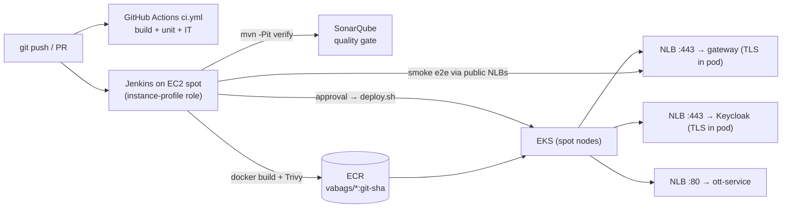

# Delivery & Roadmap — CI/CD, Deployment, Open Work

How VA-BAGS is built, tested and shipped, the decisions behind that, and the work still open.
Domain design lives in docs 01–09; feature backlog status lives in [10-backlog.md](10-backlog.md).

---

## 1. What exists today

**Application:** 8 services (gateway, order, inventory, billing, fulfilment, notification, catalog, ott), with
CQRS (Postgres write model + Mongo projections), Tram saga orchestration with a payment pivot,
forward recovery and an admin re-drive, a transactional outbox via Eventuate CDC, Keycloak
OIDC (edge resource server, token relay, M2M audience checks, OTT relying party),
correlation and tracing, and a two-level catalog cache. See the code walkthrough
([VA-BAGS-Code-Walkthrough.docx](VA-BAGS-Code-Walkthrough.docx)).

**Engineering:**

| Area | What | Where |
|---|---|---|
| Build | One Maven reactor, Eventuate BOM-managed versions, JaCoCo on every module | `pom.xml` |
| Unit tests | Pure JUnit 5 + Mockito + AssertJ (DD-25), incl. `PlaceOrderSagaTest` (routing, command mapping, reply capture, failure mapping, cancel checkpoints, fulfil/park, finalize) | `*/src/test` |
| Integration tests | Testcontainers (`mvn -Pit verify`): `OrderPersistenceIT`, `NotificationDeliveryIT`, `InventorySeedIT`, `BillingSeedIT` | `*IT.java` |
| e2e | REST Assured against a running stack with real Keycloak tokens (`-Pe2e`) | `e2e-tests/` |
| PR gate | GitHub Actions: build + unit + IT (+ optional Sonar) | `.github/workflows/ci.yml` |
| CI host | Terraform spot t3.xlarge (Jenkins + Docker + toolchain) from the pre-baked AMI, idempotent setup script, one-command local e2e | `infra/ec2/` |
| Local CI pipeline | Jenkins on the CI box: build → unit + IT → Sonar → full-stack e2e via compose + host JVMs | `jenkins/jenkins-ec2-local.ci` |
| CD pipeline | Jenkins: build → unit + IT → Sonar gate → 8 images → Trivy → ECR → approval → EKS → smoke e2e → rollback | `jenkins/Jenkinsfile.eks` |
| Cluster lifecycle | eksctl ClusterConfig (spot, no NAT, EBS CSI, access entry), create/delete scripts, nightly teardown job | `infra/eks/`, `jenkins/Jenkinsfile.infra` |
| Kubernetes | Kustomize base (8 services + Postgres/Kafka/Mongo StatefulSets, Redis, ZooKeeper, CDC, Keycloak) + EKS overlay (3 NLBs) + ordered deploy script | `k8s-eks/` |
| Local k8s | k3d manifests against compose infra on the host (learning path, Design/11) | `k8s/` |

Status: everything above is written. The **EKS and EC2 paths have not had a first real run yet**.
Expect first-run fixes in Keycloak's prod-mode boot/probes, the realm import, and NLB provisioning time.

---

## 2. Delivery architecture

**TLS and OIDC on AWS-provided hostnames.** ACM and Let's Encrypt can't issue certificates for
`*.elb.amazonaws.com` names we don't own. So the NLBs are plain **TCP passthrough**, and the **gateway and
Keycloak terminate TLS themselves** with a self-signed cert (`k8s-eks/scripts/gen-selfsigned-tls.sh`).
Keycloak is **split-horizon**: browsers use the public NLB URL, which is also `KC_HOSTNAME` and therefore every
token's `iss`. Pods use `http://keycloak:8080` for token/JWKS/userinfo. Resource servers set
`jwk-set-uri` (internal) + `issuer-uri` (public), so they validate `iss` without discovery at boot.
The OTT login client (`eks` profile) uses explicit endpoints. Because the URLs exist only once the NLBs do,
`deploy.sh` creates the NLBs first and then injects the URLs.

**Order of a deploy** (`k8s-eks/scripts/deploy.sh`): platform (namespace + gp3 StorageClass) →
public NLBs → wait for hostnames → `vabags-public` ConfigMap → generated secrets + TLS (created once) →
realm rendered with the OTT URL and the client secret → render the overlay, pin images to ECR:sha → apply → wait
(infra, then Keycloak, then the services).

**Cost discipline** (ap-south-1, rough): EKS control plane $0.10/h + 2 × t3.large spot + 3 NLBs + EBS
≈ $4–5/day while it exists. The cluster is created for a session and **deleted nightly** (the namespace goes
first so the PVC volumes and NLBs are released). The CI box is persistent spot with stop-on-interruption,
stopped when idle.

---

## 3. Decisions

| Topic | Decision | Why |
|---|---|---|
| Stateful infra on EKS | In-cluster StatefulSets on gp3 PVCs (EBS CSI) | Managed RDS/MSK/DocumentDB would exceed the budget; this is documented as the production mapping |
| Exposure | 3 NLBs via `Service type: LoadBalancer`, TCP passthrough | No custom domain, so no ACM certificate or host-based ALB routing |
| TLS | Self-signed, terminated in the gateway/Keycloak | Same reason; clients accept it explicitly |
| Secrets | Generated once by `deploy.sh` into k8s Secrets (nothing in git) | Next step: External Secrets + SSM Parameter Store via Pod Identity |
| Manifests | Kustomize for our apps; Helm only for vendor charts | Reviewable diffs for our code; vendors ship charts |
| Cluster definition | eksctl ClusterConfig in git | Declarative and quick; Terraform is a later option |
| CI host | Terraform launching the pre-baked Jenkins AMI + idempotent setup script | The AMI keeps the plugins and credentials; Terraform adds the role, disk, network and reproducibility |
| Jenkins → EKS auth | EC2 instance-profile role + EKS access entry | No stored keys; modern API instead of the `aws-auth` ConfigMap |
| Schema registry | None (DD-13) | One repo, one build; additive DTO evolution |

---

## 4. Open work (phased)

Effort: S ≤ ½ day · M ≈ 1–2 days · L ≈ 3–5 days.

**First real runs**
- [ ] `terraform apply` for the CI box; point the Jenkins tools at `/usr/lib/jvm/java-17-amazon-corretto` and `/opt/maven`; run `infra/ec2/run-e2e.sh`. **S**
- [ ] Create the EKS cluster (`JENKINS_ROLE_ARN=<instance_role_arn>`), run `Jenkinsfile.eks` end to end, fix first-run issues. **M**
- [ ] Revoke the old SonarQube token (it is still in git history). **S**

**Tests**
- [ ] Order-service ITs: placement through the API with a JWT, and the Mongo projection. **M**
- [ ] `OrderCommandController` tests with JWT ownership (404) and admin-role cases. **S**
- [ ] ITs for catalog (Mongo + Redis two-level cache), fulfilment (WireMock OTT + token), ott (audience validation). **L**
- [ ] api-gateway route × role security tests (WebTestClient + mockJwt). **S**
- [ ] Tag e2e as `smoke`/`full`; build an e2e image that runs as a k8s Job instead of from Jenkins. **M**

**Observability on Kubernetes**
- [ ] `micrometer-registry-prometheus` + saga/order business metrics. **M**
- [ ] kube-prometheus-stack, Loki, Tempo and an Alloy/OTel Collector via Helm (values in repo). **M**
- [ ] A `k8s` Spring profile: JSON stdout, OTLP → collector, sampling. **S**
- [ ] Grafana dashboards (logs + `$correlationId`, RED, saga outcomes, Kafka lag) + alert rules. **M**
- [ ] k6 load test against the dev deployment. **S**

**Platform hardening**
- [ ] External Secrets Operator + SSM; metrics-server + HPA (gateway, order) + PDBs. **M**
- [ ] dev/prod namespaces with promotion by image digest; a Jenkins shared library for the build/push/deploy steps. **L**
- [ ] Route `/v1/ops/**` (admin) through the gateway. **S**
- [ ] Billing alarm. **S**

**Polish**
- [ ] README: architecture + pipeline diagrams, "run locally", "run on EKS", demo script. **M**
- [ ] A short recorded demo as a fallback when a cluster isn't up. **S**
- [ ] Docs: catalog cache TTLs are L1 120s / L2 300s and configurable (some docs still say 15s). **S**

**Feature backlog (pick 1–2):** DLQ + replay on the projection consumers (10-backlog C1) · the
`abandon → CANCELLED_REFUNDED` escape hatch (D2) · KEDA scaling on Kafka lag · contract tests for saga
messages · Terraform for the cluster.

---

## 5. Five-minute demo

1. Log into OTT through Keycloak (Auth Code + PKCE): the video returns 403 because you aren't entitled.
2. Place a PAY_NOW order for `OTT_NETFLIX_6M` through the gateway and watch the saga reach `COMPLETED`.
3. In Grafana, follow the `correlationId` across the services in Loki, then open the Tempo waterfall (note the CDC gap).
4. Refresh OTT: the video plays (the entitlement was provisioned machine-to-machine by fulfilment).
5. Failure path: stop ott-service → the order parks in `FULFILMENT_FAILED` → restart → admin re-drive.
6. Walk the Jenkins run: quality gate → Trivy → approval → deploy → smoke → rollback on failure.
