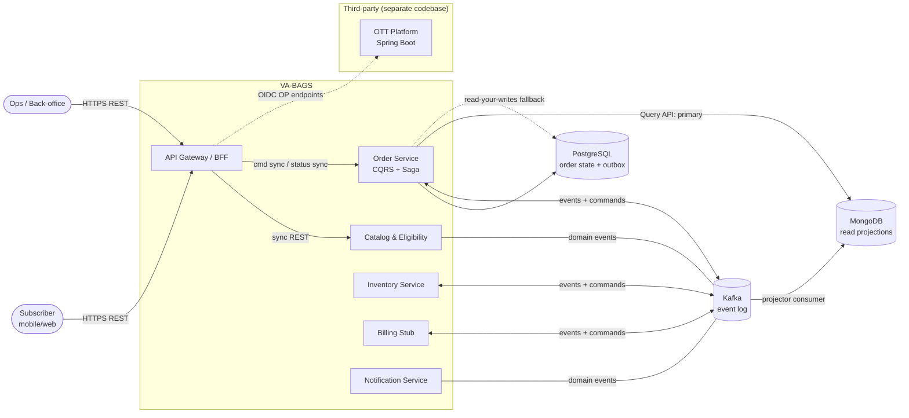
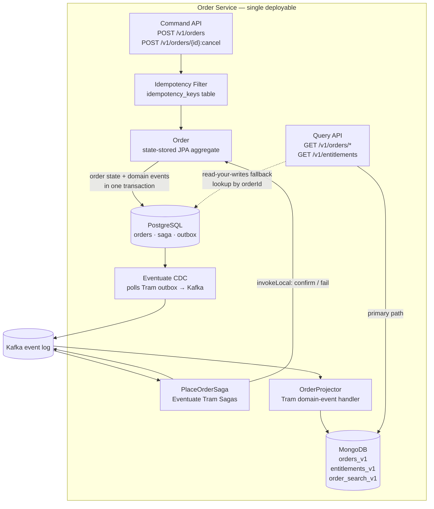
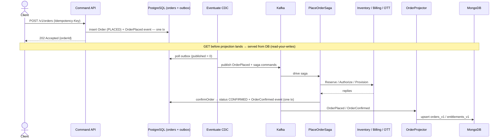
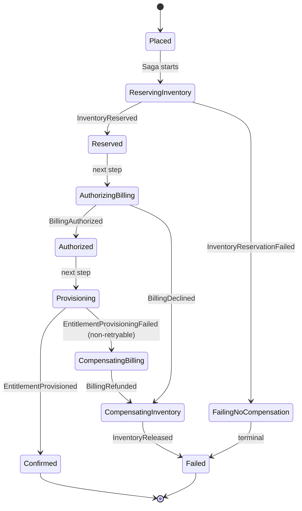
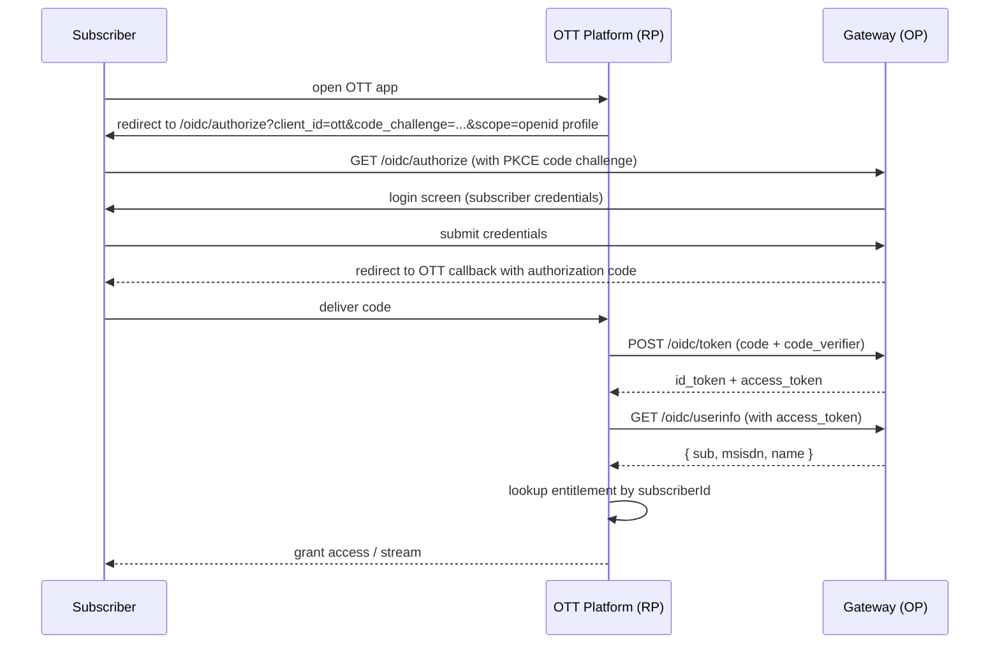
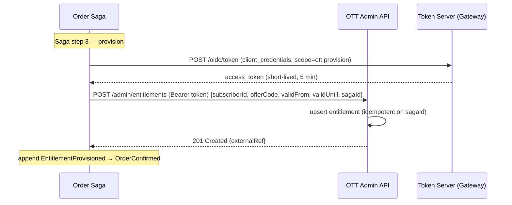

# VA-BAGS — All Diagrams

A single place to view every Mermaid diagram in the design set. Each block is the render-safe copy of a diagram that also lives in its source doc (labels are quoted so special characters like `{}`, `()`, `*`, `:` render in strict Mermaid). Reflects the post-Event-Sourcing design (DD-14 / DD-15).

| # | Diagram | Source |
|---|---------|--------|
| 1 | System context | [01-system-context.md](01-system-context.md) |
| 2 | Order service — internal architecture | [03-order-service-deep-dive.md](03-order-service-deep-dive.md) |
| 3 | Order placement — end-to-end sequence | [03-order-service-deep-dive.md](03-order-service-deep-dive.md) |
| 4 | PlaceOrderSaga — state machine | [04-saga-design.md](04-saga-design.md) |
| 5 | OIDC login flow (subscriber → OTT) | [06-ott-auth.md](06-ott-auth.md) |
| 6 | Entitlement provisioning (Order Saga → OTT) | [06-ott-auth.md](06-ott-auth.md) |

---

## 1. System context

How external actors, VA-BAGS services, the third-party OTT platform, and the data stores connect. Kafka is the durable event log; the read side serves from Mongo with a read-your-writes fallback to Postgres.

---

## 2. Order service — internal architecture

Single deployable, three internal packages. The aggregate is state-stored; order state + domain events are written in one transaction; CDC relays the Tram outbox to Kafka; the saga and projector consume from Kafka; the query API falls back to Postgres on a projection miss.

---

## 3. Order placement — end-to-end sequence

The full happy path: synchronous `202` ack, then the asynchronous outbox → CDC → Kafka → saga / projector chain. The note marks the read-your-writes window.

---

## 4. PlaceOrderSaga — state machine

Step progression with LIFO compensation. Inventory failure fails without compensation (nothing reserved yet); billing/provisioning failures unwind in reverse order.

---

## 5. OIDC login flow (subscriber → OTT)

Authorization Code + PKCE. The telco gateway is the OpenID Provider (OP); the OTT platform is the Relying Party (RP).

---

## 6. Entitlement provisioning (Order Saga → OTT)

Machine-to-machine: the saga obtains a client-credentials token, then pushes the entitlement to the OTT admin API (idempotent on `sagaId`). Distinct security context from the subscriber's user token.

