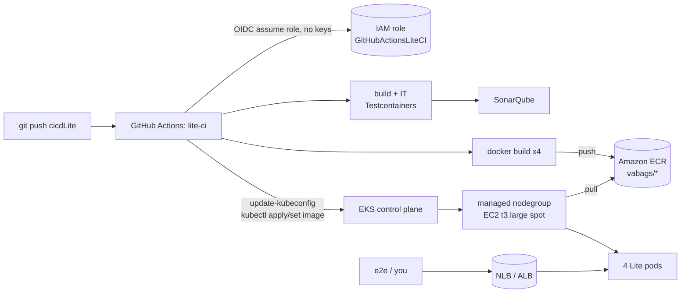

# Lite — AWS/EKS + GitHub Actions Deployment Guide

A deep-dive companion to `.github/workflows/lite-ci.yml`. It explains, end to end, how the
4 Lite images get from a `git push` to running pods on EKS, **what AWS actually builds when
you run `eksctl create cluster`**, how the pieces talk to each other, and how it scales.

> Scope: study/interview prep, ~$20 budget. Region **ap-south-1 (Mumbai)**. Cluster
> `vabags-lite`, namespace `vabags-lite`. Everything is tear-down-nightly friendly.

---

## 0. The whole pipeline at a glance



Two trust boundaries do the heavy lifting: **GitHub↔AWS** (OIDC federation, §1) and
**inside the VPC** (control plane ↔ nodes ↔ load balancer, §2–3).

---

## 1. GitHub side

### 1.1 Why OIDC (and not access keys)
Storing a long-lived `AWS_ACCESS_KEY_ID`/`SECRET` in GitHub secrets is the classic
anti-pattern — a leaked key is valid until someone rotates it. Instead, GitHub Actions is an
**OIDC identity provider**: each job can mint a short-lived signed JWT describing *who* is
running (repo, branch, workflow). AWS is told to trust that issuer, so
`aws-actions/configure-aws-credentials` exchanges the JWT for **temporary STS credentials**
(valid ~1 hour) by calling `sts:AssumeRoleWithWebIdentity`. No secret ever lives in GitHub.

### 1.2 One-time: register the OIDC provider + role in AWS
```bash
# (a) Tell IAM to trust GitHub's OIDC issuer (once per account).
aws iam create-open-id-connect-provider \
  --url https://token.actions.githubusercontent.com \
  --client-id-list sts.amazonaws.com \
  --thumbprint-list 6938fd4d98bab03faadb97b34396831e3780aea1

# (b) Trust policy — WHO may assume the role. The `sub` condition is the security control:
#     only this repo, only the cicdLite branch, can assume it (edit for main/tags as needed).
cat > trust.json <<'JSON'
{
  "Version": "2012-10-17",
  "Statement": [{
    "Effect": "Allow",
    "Principal": { "Federated": "arn:aws:iam::012468947512:oidc-provider/token.actions.githubusercontent.com" },
    "Action": "sts:AssumeRoleWithWebIdentity",
    "Condition": {
      "StringEquals": { "token.actions.githubusercontent.com:aud": "sts.amazonaws.com" },
      "StringLike":   { "token.actions.githubusercontent.com:sub": "repo:PDipak27/Value_added_benefits_GoodsServices_Base:ref:refs/heads/cicdLite" }
    }
  }]
}
JSON
aws iam create-role --role-name GitHubActionsLiteCI --assume-role-policy-document file://trust.json

# (c) What the role may DO: push to ECR + read the EKS cluster (kubeconfig). Deploy perms to
#     the cluster come from a Kubernetes RBAC mapping, not IAM (see §2.6).
cat > perms.json <<'JSON'
{
  "Version": "2012-10-17",
  "Statement": [
    { "Effect": "Allow", "Action": "ecr:GetAuthorizationToken", "Resource": "*" },
    { "Effect": "Allow",
      "Action": ["ecr:BatchCheckLayerAvailability","ecr:InitiateLayerUpload","ecr:UploadLayerPart",
                 "ecr:CompleteLayerUpload","ecr:PutImage","ecr:CreateRepository","ecr:DescribeRepositories"],
      "Resource": "arn:aws:ecr:ap-south-1:012468947512:repository/vabags/*" },
    { "Effect": "Allow", "Action": "eks:DescribeCluster", "Resource": "*" }
  ]
}
JSON
aws iam put-role-policy --role-name GitHubActionsLiteCI --policy-name lite-ci --policy-document file://perms.json
```

### 1.3 Wire the workflow to the role
In the repo (Settings → Secrets and variables → Actions):

| Kind | Name | Value / purpose |
|---|---|---|
| secret | `AWS_ROLE_ARN` | `arn:aws:iam::012468947512:role/GitHubActionsLiteCI` — the role the job assumes |
| var | `AWS_REGION` | `ap-south-1` |
| var | `EKS_CLUSTER_NAME` | `vabags-lite` |
| var | `ECR_REGISTRY` | `012468947512.dkr.ecr.ap-south-1.amazonaws.com` |
| secret | `SONAR_TOKEN`, var `SONAR_HOST_URL`, var `ENABLE_SONAR` | SonarCloud/hosted analysis |
| secret | `DOCKERHUB_USERNAME`/`TOKEN`, var `ENABLE_DOCKERHUB_PUSH` | Docker Hub push (the default active registry) |

The job already declares `permissions: id-token: write` (required for OIDC) and
`contents: read`. `configure-aws-credentials@v4` reads `AWS_ROLE_ARN`, performs the JWT→STS
exchange, and exports the temp creds for every later `aws`/`docker`/`kubectl` step.

### 1.4 What each workflow step does (cloud vs local)
- **checkout + setup-java** — GitHub runners are blank VMs (act self-hosted reused your host, so `local-ci.yml` skips these).
- **build + IT** — `mvn -Pit verify`; GitHub runners ship Docker, so Testcontainers spins real PG+Kafka.
- **SonarQube** — points at a *reachable* server (SonarCloud/hosted); your laptop's `localhost:9000` is invisible to the cloud runner.
- **build + push images** — Docker Hub by default; ECR in the AWS path.
- **deploy to EKS** — `aws eks update-kubeconfig` writes a kubeconfig whose auth calls `aws eks get-token`; `kubectl set image` rolls the Deployments to the new SHA tag.
#The aws eks update-kubeconfig command configures your local kubectl tool so you can connect to an EKS cluster
---

## 2. AWS side: what `eksctl create cluster` actually builds

```bash
eksctl create cluster \
  --name vabags-lite --region ap-south-1 \
  --nodes 1 --nodes-min 1 --nodes-max 1 \
  --node-type t3.large --managed --spot \
  --with-oidc \
  --vpc-nat-mode Disable
```
## --vpc-nat-mode Disable, to lower budget: nodes in public subnets egress via IGW, no NAT $

`eksctl` is a thin CLI over **CloudFormation**. This one command creates **two stacks**:

| Stack | Name | Builds |
|---|---|---|
| Cluster | `eksctl-vabags-lite-cluster` | VPC + subnets + routing + control-plane IAM + the EKS control plane + shared security groups |
| Nodegroup | `eksctl-vabags-lite-nodegroup-<ng>` | node IAM role + launch template + the **managed nodegroup** (→ an Auto Scaling Group of EC2) |

### 2.1 Cluster stack — the network + control plane

| Resource | Count (default) | Purpose / interaction |
|---|---|---|
| **VPC** | 1 (`192.168.0.0/16`) | Private network that holds everything. |
| **Subnets** | 3 public + 3 private (one pair per AZ: `ap-south-1a/b/c`) | Public = internet-facing (LBs, and our nodes when NAT is disabled); private = internal. Spreading across 3 AZs is what makes the cluster fault-tolerant. |
| **Internet Gateway (IGW)** | 1 | The VPC's door to the internet. Public subnets route `0.0.0.0/0 → IGW`. |
| **NAT Gateway + EIP** | 1 + 1 (mode `Single`; **0** if `--vpc-nat-mode Disable`) | Lets **private** subnets reach out (pull images, call AWS APIs) without being reachable inbound. The EIP is its stable public IP. **This is the #1 hidden cost** (~$0.045/h + data) — we disable it since our nodes sit in public subnets. |
| **Route tables** | 1 public + 1 per private subnet | Public RT: `→ IGW`. Private RT: `→ NAT` (or nothing if NAT disabled). Route tables are *how* a subnet is classified "public" vs "private". |
| **ControlPlaneSecurityGroup** | 1 | Firewall on the control-plane ENIs. |
| **ClusterSharedNodeSecurityGroup** | 1 | Attached to every node; allows **node↔node** and **control-plane↔node** traffic (kubelet :10250, DNS, etc.). This SG pair is what lets `kubectl exec`, metrics, and webhooks work. |
| **EKS cluster service role** (`ServiceRole`) | 1 IAM role | Assumed by the EKS **control plane** to manage AWS resources on your behalf — create the cross-account ENIs, wire load balancers. Has `AmazonEKSClusterPolicy`. |
| **EKS control plane** | 1 (`AWS::EKS::Cluster`) | The managed, HA API server + etcd (AWS runs it across 3 AZs). Flat **$0.10/hour even with 0 nodes** — the reason to `eksctl delete cluster` nightly. |
| **OIDC provider** (`--with-oidc`) | 1 | The cluster's *own* OIDC issuer — enables **IRSA** (IAM Roles for Service Accounts), i.e. giving a specific pod an IAM role (§2.5). |

How they interact: AWS injects **cross-account ENIs** (elastic network interfaces) from the
control plane into your subnets so the managed API server can reach your nodes' kubelets. The
two shared security groups authorize that traffic. Nodes find the API server via the cluster
endpoint; the API server reaches back through those ENIs + SGs.

### 2.2 Nodegroup stack — the compute

| Resource | Purpose |
|---|---|
| **Node IAM role** + instance profile | Assumed by each EC2 node. Three managed policies: `AmazonEKSWorkerNodePolicy` (kubelet ↔ EKS API), `AmazonEKS_CNI_Policy` (the VPC CNI plugin manages pod ENIs/IPs), `AmazonEC2ContainerRegistryReadOnly` (**pull images from ECR** — this is why nodes can pull `vabags/*` without docker login). |
| **Launch template** | The node blueprint: EKS-optimized AMI, instance type (`t3.large`), spot setting, user-data that bootstraps the kubelet and joins the cluster. |
| **Managed nodegroup** (`AWS::EKS::Nodegroup`) | AWS-managed group of nodes. It **creates and owns an Auto Scaling Group** under the hood, with `minSize=2, maxSize=4, desiredSize=2`. "Managed" = AWS handles AMI patching and graceful drain/rolling-replace on updates. |
| **Node security group** | Node-level firewall (in addition to the shared SG). |

The VPC **CNI** (`aws-node` DaemonSet) is the crucial link between §2.1 and §2.2: it assigns
each pod a **real VPC IP** from the subnet (via secondary IPs on the node's ENI). So pods are
first-class VPC citizens — an ALB can target a pod IP directly, and pod→pod is plain VPC
routing (no overlay).

### 2.3 Data flows (who reaches whom)
- **Pod → internet** (e.g. pulling a public dep, calling Keycloak if it were external): pod IP → node in **public** subnet → IGW. (With private nodes it would be → NAT → IGW.)
- **Node → ECR** (image pull): via IGW using the node role's `ECRReadOnly` policy. Large layers are the main NAT data-cost driver — another reason public-subnet nodes are cheaper.
- **Node → control plane** (kubelet, API): to the cluster endpoint, allowed by the shared SGs.
- **Internet → gateway pod**: user → **NLB/ALB** (in public subnets) → node → gateway pod. See §3.

### 2.4 Cluster mode: **managed nodegroups on EC2 (spot)**
This guide uses **managed nodegroups** — you get real EC2 nodes, AWS manages their lifecycle.
Alternatives and when you'd pick them:

| Mode | What it is | Trade-off |
|---|---|---|
| **Managed nodegroup** (ours) | EC2 nodes in an AWS-managed ASG | Full control (DaemonSets, any workload), cheapest with spot; you run the autoscaler. |
| Self-managed nodegroup | You own the ASG/AMI | Max flexibility, most ops toil. Rarely needed now. |
| **Fargate** | Serverless pods (one microVM per pod) | No nodes to manage, no autoscaler needed; but no DaemonSets, per-pod pricing, slower cold starts. |
| **EKS Auto Mode** (2024+) | AWS runs compute for you (Karpenter + LB controller built in) | Least ops; you give up some control and pay a management premium. |

We take **spot** instances (~70% cheaper) because a study cluster tolerates interruptions —
a reclaimed node just gets replaced and pods reschedule.

### 2.5 IAM, three layers (don't confuse them)
1. **Cluster service role** — the control plane's identity (manage ENIs/LBs).
2. **Node instance role** — every node's identity (join cluster, pull ECR). Coarse — *all*
   pods on a node share it.
3. **IRSA** (`--with-oidc`) — a *specific* pod's identity. A Kubernetes ServiceAccount is
   annotated with an IAM role ARN; the cluster's OIDC provider lets that pod assume just that
   role. This is how the **AWS Load Balancer Controller** gets exactly the EC2/ELB permissions
   it needs — least privilege, without widening the node role.

### 2.6 Auth: how `kubectl` from CI is allowed
Getting a kubeconfig (`eks:DescribeCluster`) is **not** cluster access. Kubernetes RBAC decides
that. Map the CI role to a cluster identity once:
```bash
# Grant the GitHub Actions role admin inside the cluster (or a scoped Role for prod).
eksctl create iamidentitymapping \
  --cluster vabags-lite --region ap-south-1 \
  --arn arn:aws:iam::012468947512:role/GitHubActionsLiteCI \
  --group system:masters --username github-actions
```
(Newer clusters can use **EKS access entries** instead of the `aws-auth` ConfigMap; `eksctl`
supports both. The idea is the same: IAM identity → Kubernetes group → RBAC.)

---

## 3. Exposing the gateway + how it autoscales

### 3.1 Getting traffic to the gateway pod
Two options — pick based on how much you want to learn:

**A. Service `type: LoadBalancer` → NLB (simplest).** Our `k8s-lite/10-api-gateway.yaml`
already uses `type: LoadBalancer`. On EKS this provisions an **NLB** in the public subnets;
its DNS name is the entry point. The e2e reads it:
```bash
kubectl -n vabags-lite get svc api-gateway -o jsonpath='{.status.loadBalancer.ingress[0].hostname}'
```

**B. Ingress → ALB (via AWS Load Balancer Controller).** Install the controller (IRSA role +
Helm), then an `Ingress` object makes it provision an **Application Load Balancer** with
path routing, TLS, etc. More realistic for an HTTP API, more moving parts:
```bash
helm repo add eks https://aws.github.io/eks-charts
helm install aws-load-balancer-controller eks/aws-load-balancer-controller \
  -n kube-system --set clusterName=vabags-lite \
  --set serviceAccount.create=false --set serviceAccount.name=aws-load-balancer-controller
```
For Lite happy-path, **A (NLB)** is enough; mention B in interviews as the ALB/Ingress path.

### 3.2 Autoscaling — two independent axes
Autoscaling in Kubernetes is **pods** and **nodes**, and they work together:

**Pods — Horizontal Pod Autoscaler (HPA).** Scales replica count on a metric (CPU/memory via
`metrics-server`, or custom). Add to a Deployment:
```bash
kubectl -n vabags-lite autoscale deploy/lite-order-service --cpu-percent=70 --min=1 --max=4
```
When order-service CPU exceeds 70%, HPA adds replicas (up to 4).

**Nodes — Cluster Autoscaler (CA) or Karpenter.** The managed nodegroup's ASG does **not**
react to pods on its own. When HPA (or a deploy) creates pods that **can't be scheduled** (no
node has room), a node autoscaler reacts:
- **Cluster Autoscaler**: watches for `Pending` pods and raises the **ASG desired count**
  (bounded by nodegroup `min=2/max=4`); scales nodes back down when they're underused. Classic,
  ASG-bound.
- **Karpenter**: skips the ASG — provisions right-sized EC2 directly for the pending pods
  (better bin-packing, faster, often cheaper). The modern default.

So the chain is: **load ↑ → HPA adds pods → pods Pending → CA/Karpenter adds a node → pods
schedule → node pulls images from ECR → ready**. Scale-down reverses it.

```bash
# Cluster Autoscaler (ASG-based) — the nodegroup was tagged by eksctl for discovery.
kubectl apply -f https://raw.githubusercontent.com/kubernetes/autoscaler/master/cluster-autoscaler/cloudprovider/aws/examples/cluster-autoscaler-autodiscover.yaml
kubectl -n kube-system set env deploy/cluster-autoscaler \
  AWS_REGION=ap-south-1 --containers=cluster-autoscaler
```

---

## 4. Cost + teardown (the $20 discipline)

| Item | Rate | Note |
|---|---|---|
| EKS control plane | **$0.10/h flat** | Runs even at 0 nodes → **delete nightly**. |
| 2× t3.large **spot** | ~$0.02–0.03/h each | On-demand is ~$0.09/h each — spot is the saver. |
| **NAT gateway** | ~$0.045/h + $/GB | **Avoided** via `--vpc-nat-mode Disable`. The classic budget-killer. |
| NLB/ALB | ~$0.02/h + LCU | One load balancer for the gateway. |
| ECR storage | $0.10/GB-mo | A few GB → cents. |

```bash
# Guardrail: alarm before you overspend.
aws cloudwatch put-metric-alarm --alarm-name lite-budget-18 \
  --namespace AWS/Billing --metric-name EstimatedCharges --dimensions Name=Currency,Value=USD \
  --statistic Maximum --period 21600 --evaluation-periods 1 --threshold 18 \
  --comparison-operator GreaterThanThreshold

# Teardown — deletes BOTH CloudFormation stacks (nodegroup first, then cluster) and the LB.
eksctl delete cluster --name vabags-lite --region ap-south-1
```
`eksctl delete cluster` reverses everything in §2 by deleting the two stacks in order. Delete
any `Service type: LoadBalancer` / Ingress **first** (or it can orphan an ELB + leak charges),
then delete the cluster.

---

## 5. End-to-end, in one paragraph (interview-ready)
A push to `cicdLite` triggers `lite-ci`. The job mints a GitHub OIDC token and swaps it via STS
for temporary AWS creds — no stored keys. It builds and integration-tests the 4 modules
(Testcontainers), analyzes with Sonar, builds images, and pushes them to ECR. It fetches an EKS
kubeconfig (`eks:DescribeCluster`) — allowed to *act* on the cluster by an IAM→RBAC mapping —
and `kubectl set image` rolls the Deployments to the new SHA. The managed nodegroup's nodes
(EC2 spot in public subnets, no NAT) pull those images from ECR using their instance role, and
the VPC CNI gives each pod a real VPC IP. An NLB in the public subnets fronts the gateway pod;
traffic flows user → NLB → node → gateway → (Kafka saga) → order/inventory/billing. Under load,
HPA adds pods and Cluster Autoscaler/Karpenter adds nodes within the nodegroup's 2–4 bounds; at
day's end `eksctl delete cluster` tears both CloudFormation stacks down to stop the $0.10/h
control-plane bill.
