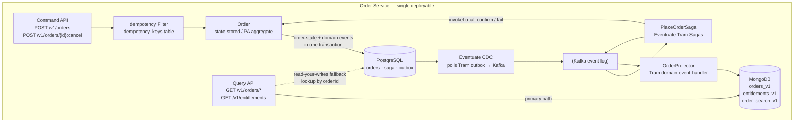

```mermaid
flowchart TB
    subgraph ORD[Order Service — single deployable]
        CMD["Command API\nPOST /v1/orders\nPOST /v1/orders/{id}:cancel"]
        IDEM[Idempotency Filter\nidempotency_keys table]
        AGG[Order\nstate-stored JPA aggregate]
        SAGA[PlaceOrderSaga\nEventuate Tram Sagas]
        PG[(PostgreSQL\norders · saga · outbox)]
        CDC[Eventuate CDC\npolls Tram outbox → Kafka]
        PROJ[OrderProjector\nTram domain-event handler]
        MONG[(MongoDB\norders_v1\nentitlements_v1\norder_search_v1)]
        QRY[Query API\nGET /v1/orders/*\nGET /v1/entitlements]
		KAFKA["(Kafka event log)"]
    end

    

    CMD --> IDEM --> AGG
    AGG -->|order state + domain events\nin one transaction| PG
    PG --> CDC --> KAFKA
    KAFKA --> SAGA
    SAGA --> KAFKA
    SAGA -->|invokeLocal: confirm / fail| AGG
    KAFKA --> PROJ --> MONG
    QRY -->|primary path| MONG
    QRY -.->|read-your-writes fallback\nlookup by orderId| PG
```